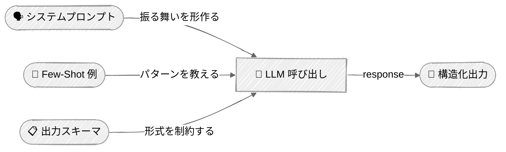

<!-- ---
title: "プロンプトエンジニアリング"
description: "システムメッセージ、few-shot例、構造化出力を含むプロンプトエンジニアリング技法を学ぶ"
icon: "wand"
--- -->

# プロンプトエンジニアリング

プロンプティング技法を通じてLLMの振る舞いを形作る方法を学びます。すべてのAIエージェントの能力は、そのプロンプトがどのように設計されているかから始まります — このチュートリアルでは、あなたが構築するあらゆるエージェントで使うことになる中核的な技法を扱います。

## 🎯 学べること

- システムプロンプトとロールエンジニアリングを使ってLLMの振る舞いを制御する
- インコンテキスト学習のためにfew-shotプロンプティングを適用する
- chain-of-thought（CoT）プロンプティングで推論を導く
- プロンプト指示を通じて構造化されたJSON出力を抽出する
- プロバイダー固有の技法を使う: Anthropic XMLスキャフォールディング、OpenAI JSONスキーマ強制
- プロンプティング戦略を並べて比較し、それぞれのトレードオフを理解する

## 📦 利用可能なサンプル

| プロバイダー                                        | ファイル                                                                   | 説明                                                   |
| ----------------------------------------------- | ---------------------------------------------------------------------- | ------------------------------------------------------------- |
|  | [01_system_prompts_anthropic.py](01_system_prompts_anthropic.py)       | システムプロンプト & ロールエンジニアリング                             |
|        | [02_system_prompts_openai.py](02_system_prompts_openai.py)             | システムプロンプト & ロールエンジニアリング                             |
|  | [03_few_shot_cot_anthropic.py](03_few_shot_cot_anthropic.py)           | Zero-shot、Few-shot & Chain-of-Thought デモ                  |
|        | [04_few_shot_cot_openai.py](04_few_shot_cot_openai.py)                 | Zero-shot、Few-shot & Chain-of-Thought デモ                  |
|  | [05_structured_output_anthropic.py](05_structured_output_anthropic.py) | 商品情報抽出 — プロンプト、XMLスキャフォールディング & ネイティブスキーマ  |
|        | [06_structured_output_openai.py](06_structured_output_openai.py)       | 商品情報抽出 — プロンプト、スキャフォールディング & スキーマ強制 |

## 🚀 クイックスタート

> **前提条件:** Python 3.11+、APIキー、uv。セットアップの詳細は [SETUP.md](../../SETUP.md) を参照してください。

```bash
uv run --directory 01-foundations/02-prompt-engineering python {script_name}

# 例
uv run --directory 01-foundations/02-prompt-engineering python 01_system_prompts_anthropic.py
```

または、[Code Runner](https://marketplace.visualstudio.com/items?itemName=formulahendry.code-runner) VS Code拡張機能を使えば、開いているスクリプトをワンクリックで実行できます。

## 🔑 キーコンセプト

### 1. プロンプトエンジニアリングのレイヤー



各レイヤーは、LLMの応答に対する制御をさらに加えます。これらを組み合わせることで、信頼性が高くパース可能な出力を生成するエージェントを構築できます。

### 2. システムプロンプト & ロールエンジニアリング

システムプロンプトは、エージェントの振る舞いを制御するための主要なレバーです。スクリプトでは、同じサポートチケット選別タスクに対して3段階の洗練度を比較しています — あいまいなチケットによって、各プロンプトが「チケットをどう解釈するか」と「何を優先するか」を決定づけられます:

| 構成                   | 何をするか                                                            |
| ------------------------------- | ----------------------------------------------------------------------- |
| **汎用アシスタント**           | ベースライン — 「あなたは頼りになるアシスタントです」（曖昧な態度を取り、一般的なアドバイスをする） |
| **役割を割り当てられたエキスパート**        | アイデンティティ + ドメイン専門知識 + 決断力（判断を下す）               |
| **役割 + 制約 + フォーマット** | 上記すべて + 厳格な出力セクション（簡潔で実用的）           |

**Anthropic** — トップレベルパラメータとしてのシステムプロンプト:
```python
response = client.messages.create(
    model="claude-sonnet-4-6",
    system="You are a senior support engineer at a SaaS company...",  # システムプロンプト
    messages=[{"role": "user", "content": "Analyze this support ticket..."}],
)
```

**OpenAI** — `instructions` によるシステムプロンプト:
```python
response = client.responses.create(
    model="gpt-4o",
    instructions="You are a senior support engineer at a SaaS company...",  # システムプロンプト
    input="Analyze this support ticket...",
)
```

> システムプロンプトが具体的で制約されているほど、出力は一貫性があり有用になります。これはエージェントにとって最も重要なプロンプトエンジニアリング技法です。

### 3. Few-Shot & Chain-of-Thought

スクリプトでは、それぞれが真価を発揮するタスクにおいて3つの技法を実演しています — なぜある技法を他より選ぶのかを示しています:

| 技法     | デモタスク                   | この技法を選ぶ理由                             |
| ------------- | --------------------------- | ---------------------------------------------- |
| **Zero-shot** | 感情分析          | モデルはすでに POSITIVE/NEGATIVE/NEUTRAL を理解している  |
| **Few-shot**  | カスタムラベル分類 | `BILLING_DISPUTE` のようなドメインラベルを教える   |
| **CoT**       | 根本原因分析         | 多段階の推論がより良い診断を生み出す |

**Zero-shot** — タスクがよく理解されている場合、例は不要:
```python
system = (
    "Classify the sentiment of the following product review.\n"
    "Respond with exactly one word: POSITIVE, NEGATIVE, or NEUTRAL."
)
```

**Few-shot** — 例を通じてモデルにあなた独自の分類体系を教える:
```python
EXAMPLES = [
    ("I was charged twice for the same subscription", "BILLING_DISPUTE"),
    ("Can't log in even after resetting my password", "ACCOUNT_ACCESS"),
]

examples_text = "\n".join(
    f'Ticket: "{text}"\nCategory: {label}' for text, label in EXAMPLES
)
```

**Chain-of-thought** — 複雑な問題に対する段階的な推論:
```python
system = (
    "Analyze this bug report step by step:\n"
    "1. What patterns do you observe? (timing, scope, triggers)\n"
    "2. What does each clue rule in or rule out?\n"
    "3. What is the most likely root cause?\n"
    "4. What would you check first to confirm?"
)
```

> **使い分けの目安:** よく知られたタスクにはZero-shot（速く、安い）。カスタムラベルやドメイン固有の分類が必要な場合はFew-shot（入力トークンが増える）。推論タスクの精度が速度より重要な場合はCoT（出力トークンが増える）。

### 4. 構造化出力とスキャフォールディング

エージェントはパース可能な出力を生成する必要があります。スクリプトでは、1つの説明文から商品データをそれぞれ3つの方法で抽出し、信頼性を比較しやすくしています:

```python
# すべての手法で使用される商品抽出スキーマ
class ProductExtraction(BaseModel):
    name: str
    category: str
    price: float
    features: list[str]
    in_stock: bool
```

**Anthropic — `output_config` によるネイティブJSONスキーマ（推奨）:**
```python
# APIレベルのスキーマ強制 — 有効なJSONが保証される
response = client.messages.parse(
    model="claude-sonnet-4-6",
    messages=[{"role": "user", "content": product_description}],
    output_format=ProductExtraction,
)
product = response.parsed_output  # 検証済みのPydanticモデルインスタンス
```

**Anthropic — XMLスキャフォールディング（プロンプティング技法）:**
```python
# XMLタグで入力を構造化 — スキーマとデータを明確に分離する
messages = [
    {"role": "user", "content": "<schema>...</schema>\n<product_description>...</product_description>"},
]
```

> **注意:** 以前のClaudeモデルは *assistant-message prefill*（アシスタントのターンを `{` で始めてJSON出力を強制する）をサポートしていました。Claude 4.6ではこのサポートが[廃止され](https://platform.claude.com/docs/en/about-claude/models/whats-new-claude-4-6#breaking-changes)、会話はユーザーメッセージで終わる必要があります。現在prefill相当の保証が必要な場合は、ネイティブスキーマ強制（下記）を優先してください。

**OpenAI — ネイティブJSONスキーマ強制:**
```python
response = client.responses.create(
    model="gpt-4o",
    instructions="Extract product information...",
    input=product_description,
    text={"format": {
        "type": "json_schema",
        "name": "product_extraction",
        "strict": True,
        "schema": { ... }
    }},
)
```

> **両プロバイダーともスキーマ強制を提供するようになりました。** Anthropicの`output_config`とOpenAIの`text.format`はどちらも、制約付きデコーディングによって有効なJSONを保証します。プロンプトベースの技法（XMLスキャフォールディング）は、プロンプティング戦略をより細かく制御したい場合に依然として有用です。

### 5. 出力の検証

プロンプトベースの手法では、構造化出力を必ず検証してください。ネイティブスキーマ強制は検証を自動的に行いますが、非準拠の出力を生む可能性がある拒否（`stop_reason: "refusal"`）やトークン上限（`stop_reason: "max_tokens"`）は確認してください:

```python
def try_parse_json(raw: str) -> dict | None:
    text = raw.strip()
    # LLMがmarkdownフェンスを付けていた場合は取り除く
    if text.startswith("```"):
        lines = text.splitlines()
        text = "\n".join(lines[1:-1])
    try:
        return json.loads(text)
    except json.JSONDecodeError:
        return None
```

## ⚠️ 重要な考慮事項

- **プロンプトインジェクション** — システムプロンプトは、悪意のあるユーザー入力によって上書きされる可能性があります。セキュリティ境界としてプロンプトだけに頼ってはいけません。これは[Tool Use](../04-tool-use/README.md)で重要になります。
- **トークンコスト** — Few-shotの例は、呼び出しごとに入力トークンを増加させます。高頻度なエージェントでは、精度向上がコストに見合うかを検討してください。
- **JSONの信頼性** — プロンプトベースのJSON抽出は失敗することがあります。本番環境で有効なJSONを保証するには、プロバイダーネイティブのスキーマ強制（Anthropicの`output_config`、OpenAIの`text.format`）を使用してください。
- **Temperature** — 一貫性が重要な分類・構造化出力タスクでは`temperature=0.0`を設定してください。これらのスクリプトはすべて、再現可能な結果を得るために低いtemperatureを使用しています。

## 👉 次のステップ

プロンプトエンジニアリングを習得したら、次に進みましょう:
- **[Chat](../03-chat/README.md)** — 会話履歴とマルチターンのやり取りを追加する
- **実験する** — 異なるロール記述を試したり、few-shotの例を増やしたり、スクリプト間で技法を組み合わせてみる
- **探求する** — 分類カテゴリやタスクスキーマを自分のドメインに合わせて変更してみる
