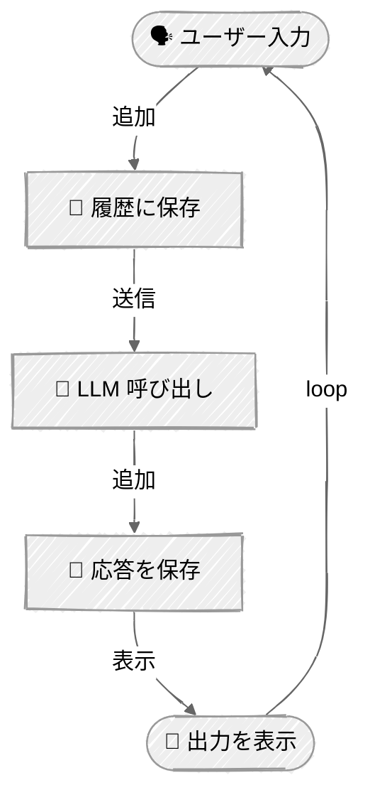

<!-- ---
title: "インタラクティブ チャット"
description: "Anthropic ClaudeとOpenAI GPTを使い、メッセージ履歴を備えたインタラクティブなチャットループを構築する"
icon: "message-circle"
--- -->

# インタラクティブ チャット

会話履歴管理を備えたインタラクティブなチャットアプリケーションを構築します。このチュートリアルでは、複数ターンにわたってコンテキストを維持し、魅力的な対話型のユーザー体験を作る方法を実演します。

## 🎯 学べること

- ユーザー入力を伴うインタラクティブなチャットループを実装する
- 複数ターンにわたる会話履歴を管理する
- 自然なマルチターン会話のためにコンテキストを維持する
- トークン使用量と会話の統計を追跡する
- より良いUXのためにリッチなコンソール出力を作成する

## 📦 利用可能なサンプル

| プロバイダー                                        | ファイル                                         | 説明                                 |
| ----------------------------------------------- | -------------------------------------------- | ------------------------------------------- |
|  | [01_chat_anthropic.py](01_chat_anthropic.py) | Claude Messages API を使ったインタラクティブチャット  |
|        | [02_chat_openai.py](02_chat_openai.py)       | OpenAI Responses API を使ったインタラクティブチャット |

## 🚀 クイックスタート

> **前提条件:** Python 3.11+、APIキー、uv。セットアップの詳細は [SETUP.md](../../SETUP.md) を参照してください。

```bash
uv run --directory 01-foundations/03-chat python {script_name}

# 例
uv run --directory 01-foundations/03-chat python 01_chat_anthropic.py
```

または、[Code Runner](https://marketplace.visualstudio.com/items?itemName=formulahendry.code-runner) VS Code拡張機能を使えば、開いているスクリプトをワンクリックで実行できます。

## 🔑 キーコンセプト

### 1. チャットループパターン



### 2. メッセージ履歴の管理

マルチターン会話の鍵は、メッセージ履歴の配列を維持することです:

**Anthropic:**
```python
class ChatSession:
    def __init__(self, model: str):
        self.client = anthropic.Anthropic()
        self.messages: list[dict[str, str]] = []
        self.model = model

    def send_message(self, user_message: str) -> str:
        # ユーザーメッセージを履歴に追加
        self.messages.append({"role": "user", "content": user_message})

        # 履歴全体をAPIに送信
        response = self.client.messages.create(
            model=self.model,
            messages=self.messages,
        )

        # 応答を抽出
        assistant_message = response.content[0].text

        # アシスタントの応答を履歴に追加
        self.messages.append({"role": "assistant", "content": assistant_message})

        return assistant_message
```

**OpenAI:**
```python
class ChatSession:
    def __init__(self, model: str):
        self.client = OpenAI()
        self.messages: list[dict[str, str]] = []
        self.model = model

    def send_message(self, user_message: str) -> str:
        # ユーザーメッセージを履歴に追加
        self.messages.append({"role": "user", "content": user_message})

        # Responses API を使って履歴全体をAPIに送信
        response = self.client.responses.create(
            model=self.model,
            input=self.messages,
        )

        # 応答を抽出
        assistant_message = response.output_text or ""

        # アシスタントの応答を履歴に追加
        self.messages.append({"role": "assistant", "content": assistant_message})

        return assistant_message
```

### 3. インタラクティブなチャットループ

継続的な会話フローを作成します:

```python
def main() -> None:
    console = Console()
    chat = ChatSession("model-name")

    # ウェルカムメッセージ
    console.print(Panel("Welcome to Chat!"))

    # インタラクティブなループ
    while True:
        # ユーザー入力を取得
        console.print("You: ", end="")
        user_input = input().strip()

        # 終了条件
        if user_input.lower() in ["quit", "exit", ""]:
            break

        # メッセージを処理
        try:
            response = chat.send_message(user_input)
            console.print(f"Assistant: {response}")
        except Exception as e:
            console.print(f"Error: {e}")
            break
```

### 4. トークン追跡

会話全体のAPI使用量を監視します:

**Anthropic:**
```python
token_tracker = AnthropicTokenTracker()

# 各API呼び出しの後
response = self.client.messages.create(...)
token_tracker.track(response.usage)

# セッション終了時
token_tracker.report()  # 入力/出力/コストの合計を表示
```

**OpenAI:**
```python
token_tracker = OpenAITokenTracker()

# 各API呼び出しの後
response = self.client.responses.create(...)
token_tracker.track(response.usage)

# セッション終了時
token_tracker.report()  # 入力/出力/コストの合計を表示
```

## ⚠️ 重要な考慮事項

**コンテキストウィンドウの制限**: 会話が長くなるにつれ、メッセージ履歴がより多くのトークンを消費します。最終的には、モデルのコンテキストウィンドウの上限に達します。これに対処するための高度な技法には以下のようなものがあります:
- 古いメッセージを切り詰める
- 会話履歴を要約する
- スライディングウィンドウを使用する

**エラーハンドリング**: 本番のチャットアプリケーションでは、以下を処理する必要があります:
- ネットワークエラーとAPI障害
- レート制限とリトライ
- 無効なユーザー入力
- トークン上限超過エラー

**コスト管理**: すべてのメッセージで会話履歴全体が送信されます。会話が長くなる = メッセージごとのコストが高くなる、ということです。トークン使用量を注意深く監視してください。

これらの戦略は、今後のチュートリアルで扱います。

## 👉 次のステップ

インタラクティブなチャットセッションを構築できたら、次に進みましょう:
- **[Tool Use](../04-tool-use/README.md)** - チャットエージェントに外部機能を追加する
- **実験する** - 異なる会話フローやシステムプロンプトを試してみる
- **拡張する** - 会話の要約や履歴の永続化などの機能を追加してみる
