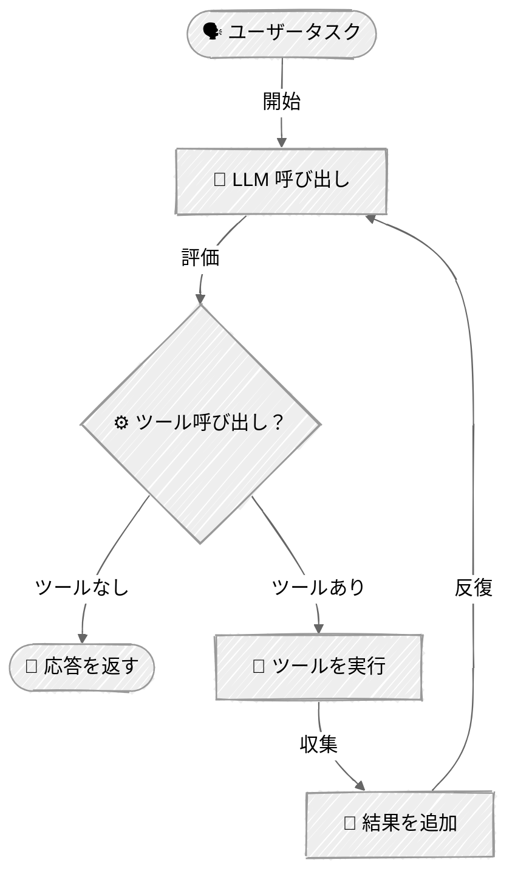

<!-- ---
title: "エージェントループ"
description: "複雑な目標を達成するためにツールを反復的に使用する自律エージェントを構築する"
icon: "repeat"
--- -->

# エージェントループ

タスクを完了するためにツールをループで使用する自律的なコーディングエージェントの構築方法を学びます。このチュートリアルは、AIエージェントの中核となるパターンを実演します: LLMを反復的に呼び出し、要求されたツールを実行し、結果をフィードバックし続けるというパターンです。

## 🎯 学べること

- エージェントループの中核パターン（LLM呼び出し → ツール実行 → 結果フィードバック）を実装する
- ファイルシステムツール（read_file、write_file、bash）を備えたコーディングエージェントを構築する
- 会話フローの中でツール呼び出しと結果を処理する
- 適切なエラーハンドリングを備えたインタラクティブなCLIエージェントを構築する

## 📦 利用可能なサンプル

| プロバイダー                                        | ファイル                                                         | 説明                                                        |
| ----------------------------------------------- | ------------------------------------------------------------ | ------------------------------------------------------------------ |
|  | [01_minimal_agent.py](01_minimal_agent.py)                   | 人間による承認（human-in-the-loop）を備えた最小構成のエージェントループ（約55行） |
|  | [02_coding_agent_anthropic.py](02_coding_agent_anthropic.py) | Claude Messages API を使った本格的なコーディングエージェント                        |
|        | [03_coding_agent_openai.py](03_coding_agent_openai.py)       | OpenAI Responses API を使ったコーディングエージェント                            |

## 🚀 クイックスタート

> **前提条件:** Python 3.11+、APIキー、uv。セットアップの詳細は [SETUP.md](../../SETUP.md) を参照してください。

```bash
uv run --directory 01-foundations/05-agent-loop python {script_name}

# 例
uv run --directory 01-foundations/05-agent-loop python 01_minimal_agent.py
```

または、[Code Runner](https://marketplace.visualstudio.com/items?itemName=formulahendry.code-runner) VS Code拡張機能を使えば、開いているスクリプトをワンクリックで実行できます。

## 🔑 キーコンセプト

### 1. エージェントループパターン

中核となるパターンはシンプルです: LLMを呼び出し、要求されたツールを実行し、結果をフィードバックし、完了するまで繰り返します。



```python
while iteration < max_iterations:
    # 1. ツールを指定してモデルを呼び出す
    response = client.messages.create(
        model=model,
        tools=TOOLS,
        messages=messages,
    )

    # 2. ツール呼び出しがなければタスク完了
    if response.stop_reason == "end_turn":
        return response.content[0].text

    # 3. ツールを実行し、結果を収集する
    for tool_call in response.tool_calls:
        result = execute_tool(tool_call.name, tool_call.input)
        tool_results.append(result)

    # 4. 結果を会話に追加して続行する
    messages.append(tool_results)
```

### 2. ツール

ツールの定義と実行については [Tool Use](../04-tool-use/README.md) で解説しています。このチュートリアルでは `read_file`、`write_file`、`bash` の3つのツールを使用します。

### 3. ツール結果の追加

**Anthropic** - アシスタントの応答とツール結果をメッセージとして追加:
```python
messages.append({"role": "assistant", "content": response.content})
messages.append({"role": "user", "content": tool_results})
```

**OpenAI Responses API** - ツール出力を `previous_response_id` とともに `input` として渡す:
```python
tool_outputs = [
    {
        "type": "function_call_output",
        "call_id": call.call_id,
        "output": json.dumps({"result": result}),
    }
    for call, result in zip(function_calls, results)
]
response = client.responses.create(
    model=model,
    tools=TOOLS,
    input=tool_outputs,
    previous_response_id=response.id,
)
```

## 🏗️ コード構造

両方のサンプルは一貫した構造に従っています:

```python
SYSTEM_PROMPT = """You are a coding agent..."""

TOOLS = [...]  # ツール定義

def execute_tool(name: str, tool_input: dict) -> str:
    """ツールを実行し、結果を返す。"""
    ...

class CodingAgent:
    """ループでツールを使用する自律エージェント。"""

    def __init__(self, model: str):
        self.client = ...
        self.model = model
        self.max_iterations = 10

    def run(self, task: str) -> str:
        """与えられたタスクに対してエージェントループを実行する。"""
        # エージェントループの実装
        ...

def main() -> None:
    """ウェルカムメッセージを備えたインタラクティブなCLI。"""
    agent = CodingAgent()

    while True:
        user_input = input("You: ")
        if user_input.lower() in ("exit", "quit", "q"):
            break
        response = agent.run(user_input)
        print(f"Agent: {response}")
```


## 👉 次のステップ

エージェントループのパターンを習得したら:
- ツールを追加する（Web検索、データベースクエリ、API呼び出しなど）
- 破壊的な操作に対するツール確認を実装する
- 長い会話のためのメモリ/コンテキスト管理を追加する
- より良いUXのためにストリーミング応答を検討する
