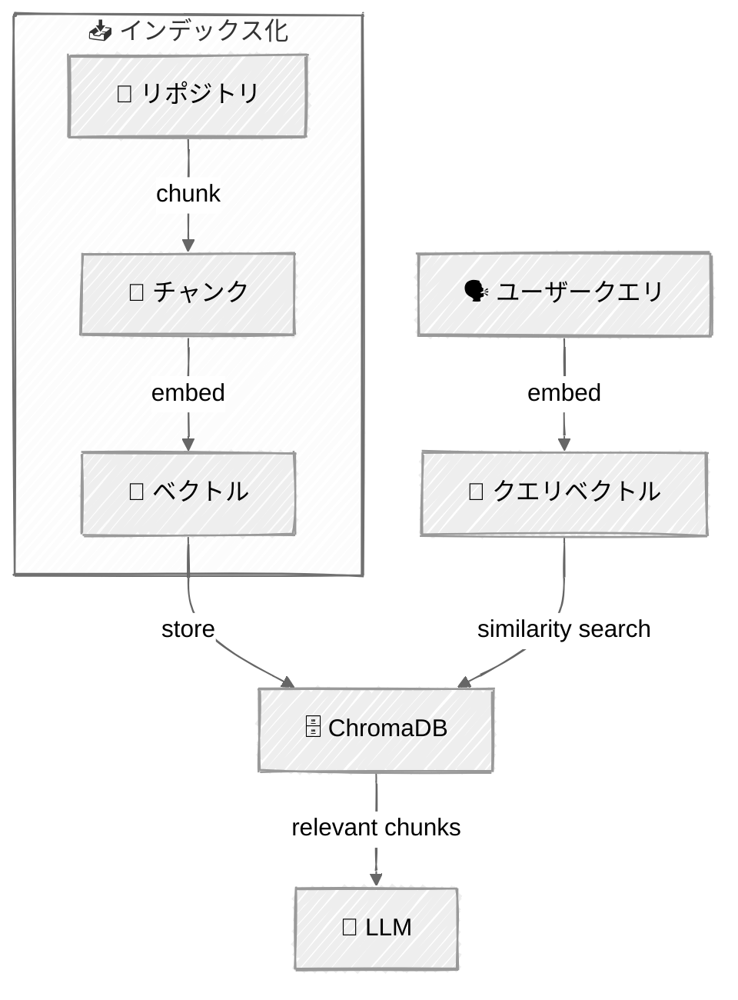

<!-- ---
title: "コードベースナビゲーター"
description: "検索・ツール・メモリを使ってコードベースを探索する拡張LLMエージェント"
icon: "layers"
--- -->

# コードベースナビゲーター

エンジニアが不慣れなコードベースを探索し、理解するのを助けるエージェントです。任意のGitHubリポジトリを指定すると、クローン・インデックス化を行い、セッションをまたいでメモリを維持しながらセマンティック検索を使って質問に答えます。

> Anthropicの「Building Effective Agents」における[拡張LLM (Augmented LLM)](https://www.anthropic.com/engineering/building-effective-agents)パターン — 検索・ツール・メモリで強化されたLLM — を実装しています。


> **📚 セットアップと実行:** 前提条件・セットアップ手順・チュートリアルの実行方法は [SETUP.md](../../SETUP.md) を参照してください。

## 🎯 学べること

- すべてのエージェントパターンの基盤となる**拡張LLM**を理解する
- ChromaDBとsentence-transformersを使った**検索拡張生成（RAG）**を実装する
- エージェントループを通じてLLMが自律的に呼び出せる**ツール**に接続する
- セッションをまたいでコンテキストを維持する永続的な**メモリ**を追加する
- 実際のコードベースを探索する実用的なエージェントを構築する

## 📦 利用可能なサンプル

| # | スクリプト | プロバイダー | 内容 |
|---|--------|----------|---------------------|
| 01 | `01_codebase_navigator.py` |  | RAG・ツール・メモリを備えた完全な拡張LLM |

> **コントリビューション歓迎！** このチュートリアルを他のプロバイダーに移植する作業に協力してくれる方を探しています。貢献したい場合は [#13 — Port to OpenAI API](https://github.com/agenticloops-ai/ai-agents-engineering/issues/13) を参照してください。

## 🔑 キーコンセプト

### 拡張（Augmentations）

**検索（RAG）** — ChromaDBとsentence-transformersを使い、インデックス化されたコードベースに対してセマンティック検索を行います。エージェントは、単なるキーワードではなく意味に基づいて関連するコードチャンクを見つけるための検索クエリを生成します。

| コンポーネント | 説明 |
|-----------|-------------|
| **ベクトルストア** | 埋め込み済みコードチャンクを格納するローカルのChromaDB |
| **チャンキング** | AST（抽象構文木）を意識したチャンキング用のTree-sitter（関数、クラス、モジュール単位） |
| **埋め込み** | ローカル埋め込み用のSentence-transformers（`all-MiniLM-L6-v2`） |

**ツール** — リポジトリのクローン、ファイルの読み込み、コード検索、パターンのgrepを行います。LLMはAnthropicのネイティブなツール使用APIを通じて、どのツールをいつ使うかを判断します。

| ツール | 目的 | 使用例 |
|------|---------|-------------|
| `clone_and_index` | GitHubリポジトリをクローンしてインデックス化する | 「pallets/flaskをインデックス化して」 |
| `list_repos` | インデックス化済みのすべてのリポジトリを一覧表示する | 「どのリポジトリを持っている？」 |
| `search_code` | コードに対するセマンティック検索 | 「ルーティングはどう動く？」 |
| `read_file` | 行番号付きでファイルを読み込む | 特定のファイルを読む |
| `list_directory` | リポジトリの構造を探索する | 「プロジェクトの構成を見せて」 |
| `grep` | 正規表現パターン検索 | 「TODOコメントをすべて見つけて」 |
| `save_memory` | 事実・洞察・好みを永続化する | パターンを発見した際に自動で実行 |
| `recall_memory` | 保存されたメモリを取得する | セッション開始時に自動で実行 |

**メモリ** — 事実・洞察・ユーザーの好みを保存する永続的なJSONストレージです。メモリは各セッションの開始時にシステムプロンプトへ読み込まれ、以前の会話からのコンテキストをエージェントに与えます。

以下のようなコンテキストを踏まえたフォローアップを可能にします:
  > *「以前、認証ロジックを`src/auth/`で見つけましたね — 関連するミドルウェアも探しましょうか？」*

### エージェントループ

これを機能させる中核パターンです（[Agent Loop](../05-agent-loop/README.md)チュートリアルと同じ）。

このループは、LLMがツール呼び出しなしでテキストのみで応答する（＝回答するのに十分な情報を持っている）まで続きます。

### RAGパイプライン



**チャンキング戦略**: Pythonファイルはトップレベルの`class`/`def`定義で分割されます。それ以外のファイルは50行ごとに10行のオーバーラップを持たせて分割されます。教育目的にはよく機能するシンプルなヒューリスティックです。

**埋め込みモデル**: sentence-transformers経由の`all-MiniLM-L6-v2` — 軽量で、ローカルで動作し、外部APIを必要としません。

## 🏗️ コード構造

```
06-codebase-navigator/
├── 01_codebase_navigator.py             # メインエントリーポイント — エージェント + CLI
├── store/
│   ├── memory.py                   # JSONベースの永続メモリ
│   └── vector.py                   # 埋め込み用のChromaDBラッパー
├── indexer/
│   ├── chunker.py                  # ファイルのチャンキング戦略
│   └── embedder.py                 # Sentence-transformer埋め込み
├── tools/
│   ├── memory.py                   # save_memory、recall_memory
│   ├── repo.py                     # clone_and_index、list_repos
│   ├── files.py                    # read_file、list_directory
│   └── search.py                   # search_code、grep
├── repos/                          # クローンされたリポジトリ（gitignore対象）
├── data/                           # ChromaDBの永続化データ（gitignore対象）
└── memory.json                     # 永続メモリ（gitignore対象）
```

## 💬 セッション例

```
Codebase Navigator

> index the flask repo from pallets/flask
  [tool: clone_and_index] {"repo":"pallets/flask"}
  → Indexed 'pallets/flask': 142 files, 847 chunks. Ready to search!

Navigator:
pallets/flaskのインデックス化に成功しました。何を探索しましょうか？

> how does routing work?
  [tool: search_code] {"query":"routing request handling","repo":"pallets-flask"}
  → Search results for: 'routing request handling'

Navigator:
Flaskのルーティングは、Werkzeugのルーティングシステムの上に構築されています。仕組みは以下の通りです:

1. **ルート登録** (`src/flask/scaffold.py:42`)
   ルートは `@app.route()` デコレータを通じて登録されます...

2. **URLマップ** (`src/flask/app.py:315`)
   FlaskはWerkzeugの`Map`オブジェクトを保持します...

> find all TODO comments
  [tool: grep] {"pattern":"TODO","repo":"pallets-flask"}
  → Found 3 matches for `TODO`

Navigator:
Flaskのコードベースで3件のTODOコメントが見つかりました:
- `src/flask/testing.py:89` — TODO: deprecate this in 3.1
...
```

## ⚠️ 重要な考慮事項

- **埋め込みモデルの選択** — `all-MiniLM-L6-v2`を使用しているのは、小さく（約80MB）、追加のAPIキーなしでローカルで動作し、RAGを教えるには十分な性能を持っているためです。本番用のコード検索では、コード特化モデル（CodeBERTやOpenAI埋め込みなど）の検討をおすすめします
- **初回実行時に埋め込みモデルをダウンロード** — モデルはHuggingFaceから一度だけダウンロードされ、ローカルにキャッシュされます
- **大規模なリポジトリはインデックス化に時間がかかる** — 数百のファイルをチャンキング・埋め込みするには忍耐が必要です
- **ChromaDBはローカルに永続化される** — インデックス化されたリポジトリは`./data/chroma/`に保存され、再起動後も残ります
- **メモリは無制限に増え続ける** — 本番環境では、古いメモリを制限したり要約したりする仕組みが必要です
- **ASTパースは行っていない** — チャンキングは言語を意識したパースではなく、シンプルな行ベースのヒューリスティックを使用しています

## 👉 次のステップ

- **[Prompt Chaining](../../02-effective-agents/01-prompt-chaining/README.md)** — タスクを連続したLLM呼び出しに分解する
- 複数のリポジトリをインデックス化し、リポジトリ横断の質問をしてみる
- 異なる埋め込みモデルを試してみる
- 新しいツール（例: `run_tests`、`explain_function`）を追加してみる
- より良い検索結果を得るために異なるチャンキング戦略を試してみる
