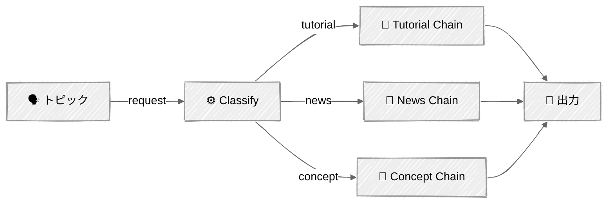

<!-- ---
title: "ルーティング"
description: "受信したリクエストを分類し、専門のハンドラーに振り分ける"
icon: "split"
--- -->

# ルーティング — コンテンツストラテジスト

コンテンツ分析に基づいて専門のハンドラーにルーティングします。ルーターは正しい*トーン*だけでなく、正しい*構造*を選びます——誤ったルーティングは出力形式そのものの誤りを意味します。

## 🎯 学べること

- LLMによる構造化出力（ツール使用）を使って入力を分類する
- 構造的に異なるコンテンツタイプのために専門チェーンを設計する
- 汎用的なプロンプトが平凡な結果しか生まない理由を理解する
- 分類器 → 専門チェーンというルーティングシステムを構築する

## 📦 利用可能なサンプル

| プロバイダー | ファイル | 説明 |
|----------|------|-------------|
|  | [01_routing.py](01_routing.py) | 3つの専門ルートを持つコンテンツストラテジスト |

## 🚀 クイックスタート

> **前提条件:** Python 3.11+、APIキー、uv。セットアップの詳細は [SETUP.md](../../SETUP.md) を参照してください。

```bash
uv run --directory 02-effective-agents/02-routing python {script_name}

# 例
uv run --directory 02-effective-agents/02-routing python 01_routing.py
```

または、[Code Runner](https://marketplace.visualstudio.com/items?itemName=formulahendry.code-runner) VS Code拡張機能を使えば、開いているスクリプトをワンクリックで実行できます。

## 🔑 キーコンセプト

### 構造化出力による分類

Anthropicの`tool_choice`を使って構造化された分類出力を強制します——パース処理は不要です:

```python
tool_choice={"type": "tool", "name": "classify_content"}
```

分類器は`content_type`（tutorial、news、concept）と、透明性のための`reasoning`を返します。ツール呼び出しを強制することで、出力は常にスキーマに一致する有効なJSONになります——正規表現や文字列パースは不要です。

### 専門ルート

各ルートは、そのコンテンツ構造に最適化された小さなプロンプトチェーンです:

- **Tutorial**（ハウツー）: 前提条件 → ステップバイステップ → トラブルシューティング
- **News/発表**: 変更点の要約 → 影響分析 → 行動喚起
- **Concept Explainer**: 例え話 → アーキテクチャの説明 → メリット/デメリット

重要な洞察: チュートリアルには手順の前に前提条件が必要で、ニュース記事には影響分析が必要で、コンセプト解説には例え話が必要です。単一の汎用プロンプトでは、この3つの構造すべてをうまく生成することはできません。

### ルーティング vs チェイニング

ルーティングはプロンプトチェイニングの上に構築されますが（各ルート*自体*がチェーンです）、どのチェーンを実行するかを決定する分類ステップが追加されます:



入力が単に異なるトーンやスタイルではなく、**構造的に異なる**処理を必要とする場合にルーティングを使いましょう。

### コールバックパターン

プロンプトチェイニングのチュートリアルと同様に、`ContentRouter`クラスは直接出力する代わりに、コールバック経由でイベントを発行します。これによりクラスはUIに依存しなくなります——イベントをどうレンダリングするかは`main()`関数が決定します:

```python
RouterCallback = Callable[[str, dict[str, Any]], None]
```

イベント: `classify_start`、`classify_complete`、`chain_start`、`chain_complete`。

## ⚠️ 重要な考慮事項

- 分類精度が重要です——誤ったルート = 誤った出力形式
- ルートは明確に区別しましょう。2つのルートが大きく重なる場合、それらは1つのルートにすべきです
- 分類器のプロンプトには、明確で曖昧さのないカテゴリ定義が必要です
- 各ルートは独自のLLM呼び出しチェーンを追加します——トークンコストはルートの複雑さに応じて増加します

## 👉 次のステップ

- [03 - Parallelization](../03-parallelization/) — 独立したLLM呼び出しに作業をファンアウトする
- 実験: 4つ目のルートを追加してみる（例: 異なる構造を持つ「Opinion/Editorial」）
