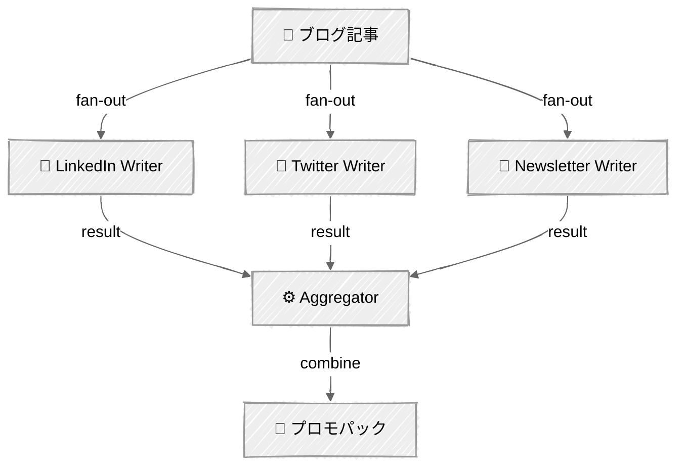
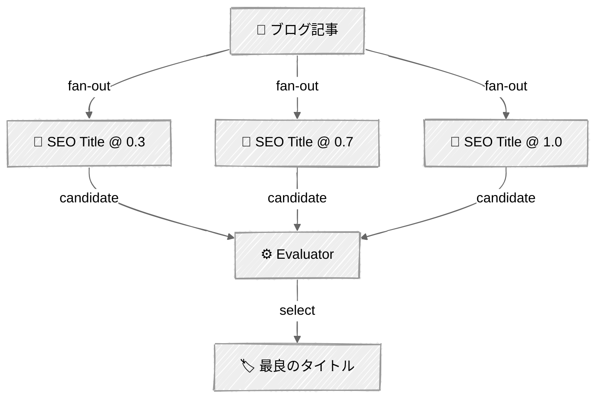

<!-- ---
title: "並列化"
description: "複数のLLM呼び出しに同時に作業をファンアウトし、結果を集約する"
icon: "layers"
--- -->

# 並列化 — ソーシャルメディア一斉配信

独立した作業のためのファンアウト、統合のためのファンイン。独立したタスクは並行して実行され（より高速に）、その後1つの成果物へと集約されます。タスクは真に独立している必要があります——タスクBがタスクAの出力に依存している場合は、並列化してはいけません。

## 🎯 学べること

- `ThreadPoolExecutor`を使って独立したLLM呼び出しをファンアウトする
- 並列の結果を1つの統合された出力に集約する
- 投票パターンを実装する: 異なるtemperatureで候補を生成し、評価する
- イベントコールバックでパイプラインロジックをUIから分離する
- タスクが真に独立しているときと、依存関係があるときの違いを理解する

## 📦 利用可能なサンプル

| プロバイダー | ファイル | 説明 |
|----------|------|-------------|
|  | [01_parallelization.py](01_parallelization.py) | ソーシャルメディアのプロモパック + SEOタイトル投票 |

## 🚀 クイックスタート

> **前提条件:** Python 3.11+、APIキー、uv。セットアップの詳細は [SETUP.md](../../SETUP.md) を参照してください。

```bash
uv run --directory 02-effective-agents/03-parallelization python {script_name}

# 例
uv run --directory 02-effective-agents/03-parallelization python 01_parallelization.py
```

または、[Code Runner](https://marketplace.visualstudio.com/items?itemName=formulahendry.code-runner) VS Code拡張機能を使えば、開いているスクリプトをワンクリックで実行できます。

## 🔑 キーコンセプト

### ファンアウト / ファンイン

ブログ記事（`input/`から選択するか、カスタムで貼り付けたもの）は、3人の独立したライターに同時に送られます:



各ライターは焦点を絞ったシステムプロンプトを持ち、別々のスレッドとして実行されます。結果は完了次第収集され、`output/`に保存される「プロモパック」に集約されます。

### 投票パターン

異なるtemperature（0.3、0.7、1.0）で3つのSEOタイトル候補を生成し、評価者を使って最も良いものを選びます:



低いtemperatureは安全で予測可能なタイトルを生成します。高いtemperatureは創造的で意外性のあるタイトルを生成します。評価者は多様な候補プールの中から最良のものを選びます——入力の多様性が高いほど、選択の質も上がります。

### スレッドセーフティ

AnthropicのPythonクライアントはスレッドセーフです。各`ThreadPoolExecutor`ワーカーは独立して自身のAPI呼び出しを行います。トークン追跡は単純な整数の加算を使用しています（このユースケースでは安全です）。

### イベントコールバック

`ParallelContentGenerator`クラスは、コールバック経由でイベント（`fanout_start`、`writer_complete`、`voting_start`など）を発行します——進捗をどうレンダリングするかは呼び出し側が決定します。これにより、パイプラインロジックはUIの関心事から解放されます:

```python
def run(self, blog_post: str, on_event: GeneratorCallback | None = None) -> dict[str, str]:
```

これは[01 - Prompt Chaining](../01-prompt-chaining/)でステップの進捗表示に使われているのと同じパターンです。

## ⚠️ 重要な考慮事項

- タスクは真に独立している必要があります——タスクBがタスクAの出力に依存している場合は並列化しないでください
- 同時呼び出しが増えるほど、APIのバースト使用量が増加します。レート制限に注意してください
- タスクごとのエラーハンドリング: 1つの失敗がファンアウト全体をクラッシュさせるべきではありません
- スレッド数は独立したタスクの数に合わせ、それを超えないようにしてください

## 👉 次のステップ

- [04 - Orchestrator-Workers](../04-orchestrator-workers/) — 何を並列化するかをLLMに動的に判断させる
- 実験: 非同期並列化のために`anthropic.AsyncAnthropic`と`asyncio`を追加してみる
