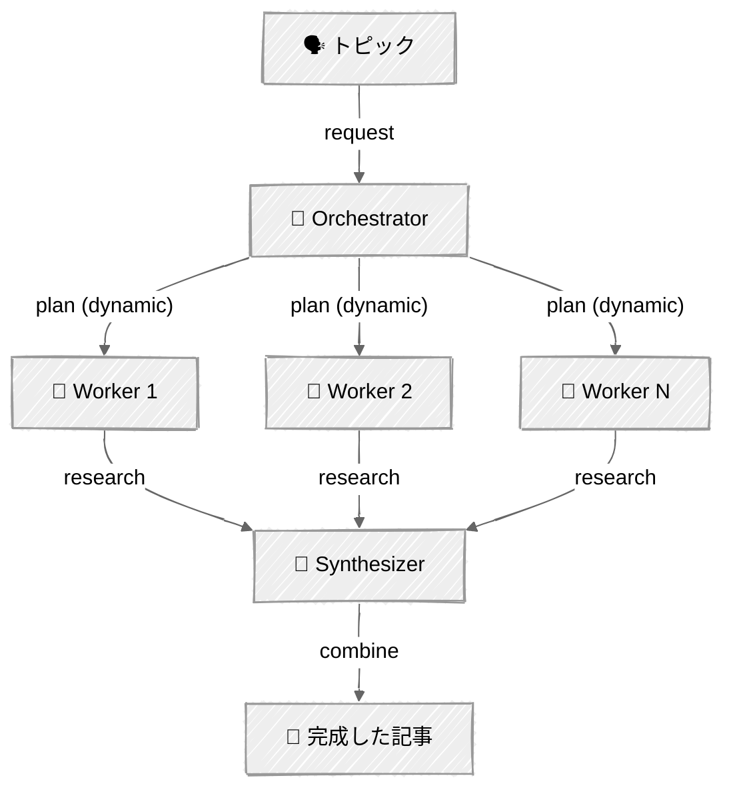

<!-- ---
title: "オーケストレーター・ワーカー"
description: "中心となるLLMが動的にタスクを分解し、並列ワーカーに委任する"
icon: "network"
--- -->

# オーケストレーター・ワーカー — 深掘りリサーチャー

中心となるLLMが動的にタスクを分解し、サブタスクをワーカーLLMに委任し、その結果を統合します。プログラマーが定義するのは、具体的なタスクではなくワーカーの能力です。

## 🎯 学べること

- タスク分解を動的に計画するオーケストレーターとしてLLMを使用する
- ワーカーの能力を定義しつつ、具体的なタスクの決定はオーケストレーターに任せる
- スループットのためにワーカーの実行を並列化する
- 多様なリサーチを、まとまりのある最終出力に統合する

## 📦 利用可能なサンプル

| プロバイダー | ファイル | 説明 |
|----------|------|-------------|
|  | [01_orchestrator_workers.py](01_orchestrator_workers.py) | 動的なサブトピック計画を持つ深掘りリサーチャー |

## 🚀 クイックスタート

> **前提条件:** Python 3.11+、APIキー、uv。セットアップの詳細は [SETUP.md](../../SETUP.md) を参照してください。

```bash
uv run --directory 02-effective-agents/04-orchestrator-workers python {script_name}

# 例
uv run --directory 02-effective-agents/04-orchestrator-workers python 01_orchestrator_workers.py
```

または、[Code Runner](https://marketplace.visualstudio.com/items?itemName=formulahendry.code-runner) VS Code拡張機能を使えば、開いているスクリプトをワンクリックで実行できます。

## 🔑 キーコンセプト



### 動的な分解

[03 - Parallelization](../03-parallelization/)（ファンアウトをハードコードする）とは異なり、オーケストレーターはLLMを使って、入力に基づいて*どの*サブトピックを調査するかを決定します:

```python
tool_choice={"type": "tool", "name": "create_research_plan"}
```

「Bun vs Node.jsを比較して」というリクエストは、次のような結果を生むかもしれません: パフォーマンス、NPM互換性、デバッグ、デプロイ、コミュニティ。

### ワーカーパターン

ワーカーは汎用的なリサーチャーです——オーケストレーターが具体的なプロンプトを与えます。あなたが定義するのは、具体的なタスクではなくワーカーの*能力*（トピックを深く調査する）です。これが並列化との重要な違いです: 作業の分割をLLMが決定します。

### 統合

すべてのワーカーが完了した後、シンセサイザーがそれぞれの独立したリサーチを、適切な流れと相互参照を持つまとまりのある記事に統合します。これは単なる連結ではなく、独自のシステムプロンプトを持つ別のLLM呼び出しです。

## ⚠️ 重要な考慮事項

- オーケストレーターの計画の質が、最終出力の質を決定します
- ワーカーは独立しています——互いの調査結果を参照することはできません
- サブトピックが増えるほど、API呼び出しも増え、コストも高くなります。3〜5個に制限することを検討してください

## 👉 次のステップ

- [05 - Evaluator-Optimizer](../05-evaluator-optimizer/) — 品質フィードバックループを追加する
- 実験: ワーカーに異なるモデルを与えてみる（シンプルなトピックには高速なモデル、複雑なトピックには高性能なモデル）
