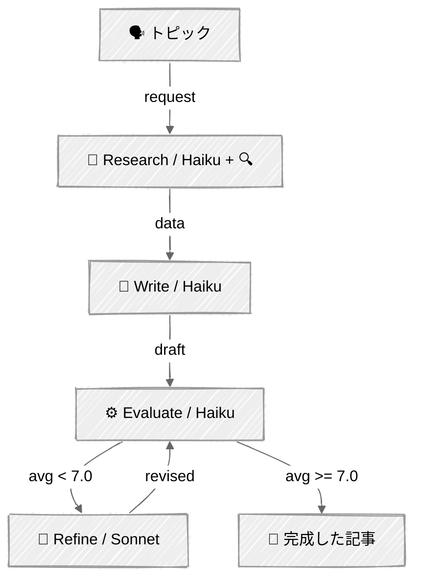

<!-- ---
title: "評価者・最適化"
description: "あるLLMが生成し、別のLLMが批評し、品質基準を満たすまでそのサイクルを繰り返す"
icon: "refresh"
--- -->

# 評価者・最適化 — 編集者のデスク

あるLLMが応答を生成し、別のLLMがそれをループで評価し、品質基準を満たすまで改善を繰り返します。生成者と評価者は、それぞれ異なる目的を持つ異なるプロンプトです。

## 🎯 学べること

- 定義された観点で生成コンテンツを採点する審判としてLLMを使う
- 評価基準を定義し、構造化されたツール出力を通じてそれを強制する
- 品質基準に収束する、評価 → 改善のループを構築する
- 相反するインセンティブを避けるため、生成者と評価者の役割を分離する

## 📦 利用可能なサンプル

| プロバイダー | ファイル | 説明 |
|----------|------|-------------|
|  | [01_evaluator_optimizer.py](01_evaluator_optimizer.py) | 5次元評価ループによるブログ記事の改善 |

## 🚀 クイックスタート

> **前提条件:** Python 3.11+、APIキー、uv。セットアップの詳細は [SETUP.md](../../SETUP.md) を参照してください。

```bash
uv run --directory 02-effective-agents/05-evaluator-optimizer python {script_name}

# 例
uv run --directory 02-effective-agents/05-evaluator-optimizer python 01_evaluator_optimizer.py
```

または、[Code Runner](https://marketplace.visualstudio.com/items?itemName=formulahendry.code-runner) VS Code拡張機能を使えば、開いているスクリプトをワンクリックで実行できます。

## 🔑 キーコンセプト



### パイプライン: リサーチ → 執筆 → 評価 → 改善

このパイプラインは、トークンコストを制御するためにWeb検索を執筆から切り離しています:

1. **リサーチ** — Web検索で最新データを収集する（Haiku + `web_search`ツール）
2. **執筆** — リサーチデータから統合する、ツールなし（Haiku、テキストのみ）
3. **評価** — 構造化出力による5次元スコアリング（Haiku、`tool_choice`）
4. **改善** — フィードバック + 完全な下書きから書き直す、ツールなし（Sonnet）

Web検索は1回の検索あたり約25,000〜35,000の入力トークンを消費します。それをリサーチフェーズに限定することで、執筆と改善のステップを軽量に保てます。

### 関心の分離

ライター、評価者、リファイナーは根本的に異なる目的を持っています:
- **ライター**: リサーチデータから創造的で魅力的なコンテンツを生成する
- **評価者**: 客観的な基準に照らして品質を批判的に評価する
- **リファイナー**: 文体を維持しながら具体的なフィードバックに対応する

これらを1つのプロンプトに統合すると、相反するインセンティブが生まれます。分離することで、的を絞った改善が可能になります。

### 構造化された評価

5つの観点（1〜10点）でスコアリング:

- **明瞭さ** — エンジニアは読み返さずに理解できるか？
- **技術的正確性** — 情報は正確で最新か？
- **構成** — 論理的な流れで、読みやすいか？
- **エンゲージメント** — エンジニアはこれを読みたいと思うか？
- **人間らしさ** — 実在の人間が書いたような文章か？

加えて: 具体的な問題点と実行可能な提案——これらは構造化されたフィードバックとしてリファイナーに渡されます。

### 収束

このループは、平均スコアが閾値（デフォルト7.0）以上になるか、最大改善回数（デフォルト2）に達すると終了します。ほとんどの改善は最初の改善ラウンドで起こります——収穫逓減は現実です:

```python
SCORE_THRESHOLD = 7.0
MAX_REFINEMENTS = 2
```

### トークンコストの制御

各フェーズは、必要なコンテキストのみを使用します——蓄積されたチャット履歴はありません:

- **高コストなツールを隔離する** — Web検索はリサーチで1回だけ実行され、他のすべてのフェーズはテキストのみ
- **モデルを適切なサイズにする** — Haikuがリサーチ、執筆、評価を担当し、Sonnetは文章の質が最も重要になる改善のために確保する
- **出力を制限する** — 構造化された評価は、散文ではなくコンパクトなJSONを返す

## ⚠️ 重要な考慮事項

- 評価者は過度に寛容だったり厳しかったりすることがあります——閾値を調整してください
- 評価者は採点のためにHaiku（高速・安価）を使用し、リファイナーはより高い文章品質のためにSonnetを使用します
- 収穫逓減: ほとんどの改善は最初の改善ラウンドで起こります

## 👉 次のステップ

- [06 - Human-in-the-Loop](../06-human-in-the-loop/) — ワークフローに人間のチェックポイントを追加する
- 実験: `SCORE_THRESHOLD`と`MAX_REFINEMENTS`を調整して、品質とコストのバランスを見つける
- リサーチフェーズあり/なしで出力品質を比較する
