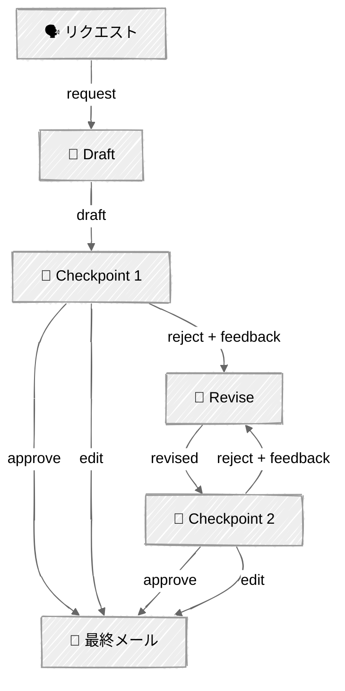

<!-- ---
title: "Human in the Loop"
description: "戦略的なチェックポイントでエージェントのワークフローを一時停止し、人間のレビュー・承認・編集を挟む"
icon: "user-check"
--- -->

# Human-in-the-Loop — 承認ゲート

戦略的なチェックポイントでワークフローを一時停止し、人間のレビューを挟みます。LLMがメールを下書きし、人間がフィードバック付きで承認・却下し、LLMが修正する——人間の監督が最も価値を発揮する場所を示します。

## 🎯 学べること

- エラーが最も複合する場所——パイプラインの早い段階にチェックポイントを配置する
- 3つの応答モードを実装する: 承認、フィードバック付き却下、直接編集
- ロジックをテスト可能に保つため、チェックポイント関数をエージェントクラスに注入する
- 無限の人間・エージェント間のピンポンを防ぐため、改善ループに上限を設ける

## 📦 利用可能なサンプル

| プロバイダー | ファイル | 説明 |
|----------|------|-------------|
|  | [01_human_in_the_loop.py](01_human_in_the_loop.py) | 2つの戦略的チェックポイントを持つメール下書き |

## 🚀 クイックスタート

> **前提条件:** Python 3.11+、APIキー、uv。セットアップの詳細は [SETUP.md](../../SETUP.md) を参照してください。

```bash
uv run --directory 02-effective-agents/06-human-in-the-loop python {script_name}

# 例
uv run --directory 02-effective-agents/06-human-in-the-loop python 01_human_in_the_loop.py
```

または、[Code Runner](https://marketplace.visualstudio.com/items?itemName=formulahendry.code-runner) VS Code拡張機能を使えば、開いているスクリプトをワンクリックで実行できます。

## 🔑 キーコンセプト



### チェックポイントの配置

2つのチェックポイントがあり、それぞれ異なるレバレッジのレベルにあります:

1. **下書き後** — 高レバレッジ。修正作業が始まる前に、誤ったトーン、抜け漏れ、意図の誤解を検知できます。
2. **修正後** — フィードバックが反映されたかを確認します。反映されていなければ、人間はさらにフィードバックを提供できます（`MAX_REVISIONS`まで）。

### 3つの応答モード

各チェックポイントは3つの選択肢を提供します:

- **(y) 承認** — 現在の出力のまま続行する
- **(n) 却下 + フィードバック** — エージェントがフィードバックを基に修正する
- **(e) 編集** — 出力を自分のテキストに直接置き換える

これにより、人間は完全なコントロールを持てます: 軽いタッチ（承認）、方向づけ（フィードバック）、あるいは手を動かす（編集）。

### 注入可能なチェックポイント関数

`CheckpointFn`型は、エージェントをテスト可能で適応性のあるものにします:

```python
CheckpointFn = Callable[[str, str, str], tuple[bool, str]]
```

- ターミナルでは: `human_checkpoint()`がRich UI経由でプロンプトを表示する
- テストでは: 自動承認するラムダを渡す
- 本番環境では: Slackメッセージ、Webhook、UIモーダルに置き換える

### レバレッジの原則

早い段階のチェックポイントが最も高いレバレッジを持ちます。チェックポイント1で誤ったトーンを検知すれば、すべての修正作業を節約できます。チェックポイント2でタイプミスを検知しても、何も節約できません。チェックポイントは、最大のカバレッジではなく最大のエラー防止のために設計しましょう。

## ⚠️ 重要な考慮事項

- チェックポイントが多すぎる = 人間がすべての作業を行うことになる（本来の目的を損なう）
- チェックポイントが少なすぎる = エージェントが修正不可能なミスを犯す
- 本番環境では、チェックポイントは非同期です——Slackメッセージ、UI承認、Webhookであり、ターミナル入力ではありません
- 際限のないコストを防ぐため、改善ループ（`MAX_REVISIONS`）に上限を設けてください

## 👉 次のステップ

- [07 - Content Writer](../07-content-writer/) — すべてのパターンを本番運用のコンテンツ生成エージェントに組み合わせる
- 実験: 確信度スコアを追加し、確信度の高い下書きを自動承認してみる
- `human_checkpoint`を、ファイルにログを書き込む関数（非同期レビューをシミュレート）に置き換えてみる
