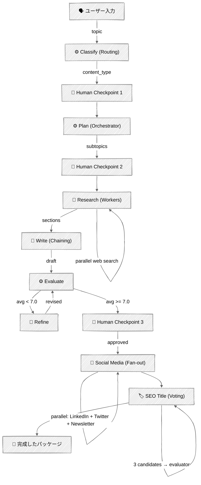

<!-- ---
title: "コンテンツライター"
description: "PydanticモデルとAsync イベントストリーミングを備え、すべてのワークフローパターンを組み合わせた本番運用のコンテンツライターエージェント"
icon: "pen-tool"
--- -->

# コンテンツライター — フルエージェント

このモジュールの**6つのパターンすべて**を、ソーシャルメディアの並列化、SEOタイトル投票、Pydanticデータモデル、そしてUI/エージェントのクリーンな分離のための型付き非同期イベントシステムを備えた1つのエージェントに組み合わせた、本番運用可能なコンテンツ生成パイプラインです。

## 🎯 学べること

- ルーティング、オーケストレーション、並列化、評価、人間のチェックポイントを1つのパイプラインに組み合わせる
- 検証済みの構造化出力と型付きイベントストリーミングのために**Pydanticモデル**を使用する
- エージェントロジックとUIレンダリングを分離するために**非同期ジェネレーター**を使用する
- チュートリアル03の**ファンアウト**パターン（ソーシャルメディア）と**投票**パターン（SEOタイトル）を適用する
- 本番品質のプロンプトを書く: 文章のトーン、AIっぽさを避けるパターン、タイプ別の指示
- トークン効率と出力品質のバランスを取る（デュアルモデル、焦点を絞ったリサーチ、選択的な切り詰め）

## 📦 利用可能なサンプル

| プロバイダー | ファイル | 説明 |
|----------|------|-------------|
|  | [01_content_writer.py](01_content_writer.py) | エントリーポイント: 非同期イベントコンシューマー + Rich UI |
| | [content_writer/models.py](content_writer/models.py) | Pydanticデータモデル + 型付きイベントシステム |
| | [content_writer/agent.py](content_writer/agent.py) | `run_stream()`非同期ジェネレーターを持つエージェントクラス |
| | [content_writer/prompts.py](content_writer/prompts.py) | 本番品質のシステムプロンプト |
| | [content_writer/tools.py](content_writer/tools.py) | 構造化出力とWeb検索のためのツールスキーマ |

## 🚀 クイックスタート

> **前提条件**: 環境セットアップについては [SETUP.md](../../SETUP.md) を参照してください。

```bash
uv run --directory 02-effective-agents/07-content-writer python 01_content_writer.py
```

## 🏗️ アーキテクチャ

```
07-content-writer/
├── 01_content_writer.py             # エントリーポイント: 非同期イベントコンシューマー + Rich UI
└── content_writer/                  # エージェントパッケージ
    ├── __init__.py
    ├── models.py                    # Pydanticモデル + 20個の型付きイベントクラス
    ├── agent.py                     # ContentWriterAgent — LLM呼び出し + 非同期run_stream()
    ├── prompts.py                   # システムプロンプト（記事 + ソーシャル + SEO）
    └── tools.py                     # ツールスキーマ（分類、計画、評価、SEO） + Web検索
```



## 🔑 キーコンセプト

### パターンの組み合わせ

パイプラインの各フェーズは、このモジュールのパターンに対応しています:

| フェーズ | パターン | チュートリアル | モデル |
|-------|---------|----------|-------|
| コンテンツタイプを分類 | ルーティング | 02 | Sonnet |
| リサーチサブトピックを計画 | オーケストレーター | 04 | Sonnet |
| 並行してリサーチ | ワーカー | 04 | Haiku |
| タイプ別のトーンで執筆 | プロンプトチェイニング | 01 | Sonnet |
| 評価 + 改善ループ | 評価者・最適化 | 05 | Sonnet |
| 人間のチェックポイント | Human-in-the-Loop | 06 | — |
| ソーシャルメディアのファンアウト | 並列化（ファンアウト） | 03 | Haiku |
| SEOタイトル投票 | 並列化（投票） | 03 | Haiku + Sonnet |

### 型付きイベントシステム

エージェントは非同期ジェネレーター経由でPydanticイベントをyieldします。エントリーポイントは`match/case`を使って各イベントをレンダリングします——エージェントロジックとUIの間に結合はありません:

```python
# エージェント側 — 型付きイベントをyieldする
async def run_stream(self, topic, ...) -> AsyncGenerator[AgentEvent, None]:
    yield ClassifyStartEvent()
    classification = await asyncio.to_thread(self.classify, topic)
    yield ClassifyDoneEvent(classification=classification)
    ...

# エントリーポイント側 — イベントタイプに対するパターンマッチング
async for event in agent.run_stream(topic, ...):
    match event:
        case ClassifyStartEvent():
            console.print("Classifying...")
        case ClassifyDoneEvent(classification=c):
            console.print(f"✓ {c.content_type.value}: {c.topic}")
        case SocialWriterDoneEvent(name=n):
            console.print(f"✓ {n}")
```

各イベントは、型を判別するための`Literal`なstageフィールドを持つPydanticの`BaseModel`です:

```python
class ClassifyDoneEvent(BaseModel):
    stage: Literal["classify_done"] = "classify_done"
    classification: ClassificationResult
```

### Pydanticデータモデル

パイプラインのすべてのデータは、緩いdictではなくPydanticで検証されます:

```python
class EvaluationResult(BaseModel):
    clarity: int = Field(ge=1, le=10)
    technical_accuracy: int = Field(ge=1, le=10)
    ...

    @computed_field
    @property
    def avg_score(self) -> float:
        return (self.clarity + self.technical_accuracy + ...) / 5
```

### コールバックによる人間のチェックポイント

エージェントは`on_human_checkpoint`コールバックを受け取ります。各ゲートで、`HumanCheckpointEvent`を構築し、（`asyncio.to_thread`経由で）同期的にコールバックを呼び出します。エントリーポイントはRichでチェックポイントをレンダリングし、ユーザーの応答を返します:

```python
# エージェントは戦略的な意思決定ポイントでこれを呼び出す
approved, feedback = on_human_checkpoint(HumanCheckpointEvent(
    checkpoint_id="classification",
    title="Classification",
    content=f"Type: {content_type.value}...",
    question="Classified as 'blog'. Correct?",
))
```

3つのチェックポイント: 分類（タイプを上書き）、リサーチ計画（サブトピックを調整）、最終レビュー（プロモパックへの承認）。

### ソーシャルメディアのファンアウト + SEO投票

記事が承認された後、チュートリアル03の2つの並列化サブパターンが実行されます:

**ファンアウト**: LinkedIn、Twitter、Newsletterのライターが`ThreadPoolExecutor`経由で並行実行されます:

```python
writers = {"linkedin": self._write_linkedin, "twitter": self._write_twitter, ...}
with ThreadPoolExecutor(max_workers=3) as executor:
    futures = {executor.submit(fn, article): name for name, fn in writers.items()}
```

**投票**: 異なるtemperature（0.3、0.7、1.0）で3つのSEOタイトル候補が生成され、構造化された評価者（`pick_best_title`を使った`tool_choice`）が勝者を選びます:

```python
SEO_EVALUATION_TOOLS = [{
    "name": "pick_best_title",
    "input_schema": {
        "properties": {
            "winning_title": {"type": "string"},
            "reasoning": {"type": "string"},
        }
    }
}]
```

### デュアルモデル戦略

- **Sonnet**: 分類、計画、執筆、評価、修正、SEO投票——品質が重要なフェーズ
- **Haiku**: リサーチ、ソーシャルメディア、SEOタイトル生成——高頻度でコストに敏感な処理

### レート制限への対処

並列フェーズ（リサーチ、ソーシャル、SEO）はAPIのレート制限を超えることがあります。エージェントは`tenacity`を使い、429エラーに対して指数バックオフでリトライします:

```python
@retry(
    retry=retry_if_exception_type(RateLimitError),
    wait=wait_exponential(multiplier=2, min=30, max=120),
    stop=stop_after_attempt(6),
)
def _call_api(self, **kwargs):
    return self.client.messages.create(**kwargs)
```

## ⚠️ 重要な考慮事項

- Web検索は**リサーチ**と**修正**の際に使用されます——初回の執筆はリサーチデータのみから統合しますが、修正ではフィードバックで言及された特定の事実を検索できます
- Web検索はリサーチワーカーごとに`max_uses: 1`を使用します——各検索はページコンテンツの約25,000〜35,000の入力トークンを注入します
- リサーチ計画は、レート制限内に収まるよう2〜3個のサブトピックに制限されています
- 品質が重要なフェーズ（執筆、評価、修正）は**完全な、切り詰められていないコンテンツ**を受け取ります——Sonnetパイプラインには非可逆圧縮はありません
- 記事は、ソーシャルメディアライター向けには2000文字、SEOタイトル向けには500文字に切り詰められます——これらは、完全なコンテキストが不要な箇所でのHaikuのコスト管理策です
- 評価・改善ループはコストを抑えるため2回の改善までに制限されています
- ソーシャルメディア + SEOは最終的な人間のチェックポイントの後ろにゲートされています——却下された記事にトークンを無駄にすることはありません
- パイプライン全体で、トピックあたり約15〜22回のAPI呼び出しが行われます
- レート制限エラーは指数バックオフでリトライされます（30秒〜120秒、最大6回まで）

## 👉 次のステップ

- `content_writer/prompts.py`を読んで、プロンプトエンジニアリングの技法を学ぶ
- 異なる`SCORE_THRESHOLD`と`MAX_REFINEMENTS`の値を試してみる
- ルーティングにさらにコンテンツタイプ（ニュース、比較、レビュー）を追加してみる
- ファンアウトにさらにソーシャルプラットフォーム（Reddit、Hacker News、Dev.to）を追加してみる
- セッションをまたぐ永続的なメモリを実装してみる
- 自律運用のための予算上限付きコスト追跡を追加してみる
