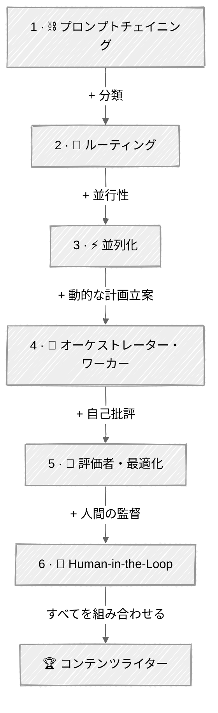

# エフェクティブエージェントパターン

おもちゃのデモと本物のエージェントを分けるアーキテクチャパターン。Anthropicの[Building Effective Agents](https://www.anthropic.com/research/building-effective-agents)に基づき、いつ連鎖させ、ルーティングし、並列化し、委譲すべきかを学びます。

## 🗺️ 進行パス

| ステップ | チュートリアル | 追加される内容 |
|:----:|----------|-------------|
| 1 | [Prompt Chaining](01-prompt-chaining/) | 連続した複数ステップのパイプライン |
| 2 | [Routing](02-routing/) | + 入力の分類 |
| 3 | [Parallelization](03-parallelization/) | + 並行実行 |
| 4 | [Orchestrator-Workers](04-orchestrator-workers/) | + 動的な分解 |
| 5 | [Evaluator-Optimizer](05-evaluator-optimizer/) | + 自己批評 |
| 6 | [Human in the Loop](06-human-in-the-loop/) | + 人間の監督 |
| 🏆 | [Content Writer](07-content-writer/) | すべてのパターンを組み合わせる |

## 💡 成功のためのヒント

1. シンプルに始める — プロンプトチェイニングは、あなたが思っている以上に多くの問題を解決します
2. 各パターンは複雑さを増します。チェイニングだけでは不十分なときにのみオーケストレーションに手を伸ばしましょう
3. 次に進む前に、すべてのスクリプトを実行し、さまざまな入力で実験してみてください
4. ブログ/コンテンツというドメインはチュートリアル全体を通して一貫しているため、パターンがどう組み合わさるかを見て取れます

## 📚 チュートリアル

### [01 - Prompt Chaining](01-prompt-chaining/)

複雑なタスクを連続したステップに分解し、各LLM呼び出しが前の出力の上に積み重なっていきます。シンプルで、デバッグしやすく、驚くほど強力です。

**学べること:** 連続したLLMパイプライン、ステップ間の品質ゲート、Outliner → Writer → Editorパターン。

**進化:** *連続したステップ*を追加します — 1回のLLM呼び出しの代わりに、各出力が次に引き継がれる複数の呼び出しを連鎖させます。

---

### [02 - Routing](02-routing/)

受信したリクエストを分類し、専門のハンドラーに振り分けます。1つのエージェントが判断し、他が実行する——これがスケーラブルなシステムの基盤です。

**学べること:** 構造化出力を使ったLLMによる分類、コンテンツタイプごとの専門チェーン、なぜ誤ったルーティングが誤った出力につながるのか。

**進化:** *入力の分類*を追加します — すべてに対して1つのチェーンを使う代わりに、入力に基づいて適切なチェーンにルーティングします。

---

### [03 - Parallelization](03-parallelization/)

複数のLLM呼び出しに同時に作業をファンアウトし、結果を集約します。タスクが独立している場合、レイテンシをスループットと引き換えます。

**学べること:** ThreadPoolExecutorによるファンアウト、投票パターン（候補を生成 → 評価 → 最良のものを選ぶ）、結果の集約。

**進化:** *並行実行*を追加します — 逐次処理の代わりに、独立したタスクを並列で実行します。

---

### [04 - Orchestrator-Workers](04-orchestrator-workers/)

中心となるエージェントが動的にタスクを分解し、専門のワーカーに委任します。今日目にするほとんどの「AIエージェント」製品の背後にあるパターンです。

**学べること:** LLMによる動的なタスク分解、ワーカーへの委任、並列リサーチ、独立した結果の統合。

**進化:** *動的な分解*を追加します — 何を並列化するかをあなたが定義する代わりに、LLMが判断します。

---

### [05 - Evaluator-Optimizer](05-evaluator-optimizer/)

あるLLMが生成し、別のLLMが批評し、品質基準を満たすまでそのサイクルを繰り返します。人間の介入なしに自己改善する出力です。

**学べること:** 生成者/評価者の役割の分離、構造化されたスコアリング、収束条件を持つフィードバックループ。

**進化:** *自己批評*を追加します — 一度きりの生成の代わりに、十分な品質になるまで反復します。

---

### [06 - Human in the Loop](06-human-in-the-loop/)

承認ゲート、エスカレーション経路、フィードバックの仕組みを構築します。本番運用されるすべてのエージェントには、いつ人間に尋ねるかという戦略が必要です。

**学べること:** 戦略的なチェックポイントの配置、承認/却下/編集のパターン、レバレッジの原則（初期のチェックポイントが最も重要）。

**進化:** *人間の監督*を追加します — 完全に自律的な動作の代わりに、重要な意思決定ポイントで一時停止します。

---

### 🏆 [07 - Content Writer](07-content-writer/)

このモジュールの**6つのパターンすべて**を1つのエージェントに組み合わせた、本番運用可能なコンテンツ生成パイプライン。ソーシャルメディアの並列化、SEOタイトル投票、Pydanticデータモデル、型付きの非同期イベントシステムを備えています。

**学べること:** パターンの組み合わせ（ルーティング + チェイニング + 並列化 + オーケストレーション + 評価 + 人間の監督）、検証済み構造化出力のためのPydanticモデル、UI/エージェント分離のための非同期ジェネレーター。

**進化:** *すべてのパターン*——ルーティング、チェイニング、並列化、オーケストレーション、評価、人間の監督——を1つの本番パイプラインに組み合わせます。

---

## 🔗 リソース

- [Building Effective Agents — Anthropic](https://www.anthropic.com/research/building-effective-agents)
- [OpenAI Agent Patterns](https://platform.openai.com/docs/guides/agents)
- [Agentic Design Patterns — Andrew Ng](https://www.deeplearning.ai/the-batch/how-agents-can-improve-llm-performance/)
