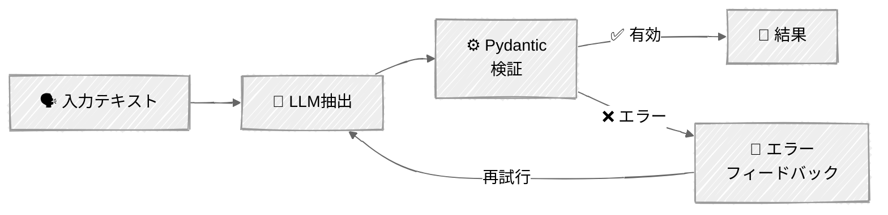

<!-- ---
title: "構造化出力とバリデーション"
description: "LLMから信頼できる型付きデータを取り出すための、本番グレードのテクニック"
icon: "code"
--- -->

# 構造化出力とバリデーション

LLMから検証済み・型付き・本番対応のデータを取得し、失敗したときの対処法を学びます。実際のサポートチケット分析ドメインを使い、基本から鉄壁の手法まで進む4つのテクニックです。

> **前提となる知識:** [02-プロンプトエンジニアリング](../../01-foundations/02-prompt-engineering/)では基本的なJSON抽出（プロンプトベース、XMLプレフィル、ネイティブスキーマ）を扱いました。このチュートリアルではさらに踏み込みます——Pydantic統合、複雑なネストされたスキーマ、バリデーション・リトライループ、バッチ抽出です。

## 🎯 学べること

- **構造化出力としてのtool_use**を使ってデータを抽出する——シンプルなスキーマと複雑なスキーマ（確立されたパターン）
- 保証された有効なJSONのために**ネイティブな制約付きデコーディング**を使う（Anthropicの`output_config`）
- バリデーション + リトライのエラーフィードバックループで**自己修復する抽出**を構築する
- 単一のAPI呼び出しで**複数アイテムをバッチ処理**する
- **AnthropicとOpenAI**のアプローチを比較する——根本的に異なるメカニズムだが、目標は同じ

## 📦 利用可能なサンプル

| プロバイダー                                   | スクリプト                                                             | 説明                                                                           |
|------------------------------------------------|------------------------------------------------------------------------|--------------------------------------------------------------------------------|
|  | [01_structured_output_anthropic.py](01_structured_output_anthropic.py) | 4つのテクニック: tool_use、ネイティブスキーマ、バリデーション+リトライ、バッチ |
|        | [02_structured_output_openai.py](02_structured_output_openai.py)       | OpenAIとの比較: 厳格なスキーマを使った`text.format`（シンプル+複雑）           |

## 🚀 クイックスタート

> **前提条件:** APIキーと環境構築については、まず [SETUP.md](../../SETUP.md) を完了してください。

```bash
# Anthropic（メイン——4つのテクニック）
uv run --directory 03-advanced-techniques/01-structured-output 01_structured_output_anthropic.py

# OpenAI（比較——異なるメカニズム）
uv run --directory 03-advanced-techniques/01-structured-output 02_structured_output_openai.py
```

両スクリプトともインタラクティブメニューを使用します——テクニックを選択して動作を確認してください。

## 🔑 キーコンセプト

### 課題: テキストから型へ

LLMはテキストを生成します。しかしアプリケーションが必要とするのは型付きデータです——列挙型、ネストされたオブジェクト、検証済みフィールド。「JSONっぽいテキストを生成する」ことと「検証済みの`TicketAnalysis`オブジェクトを返す」ことの間のギャップこそが、構造化出力のテクニックが活躍する場所です。

### テクニック1: 構造化出力としてのTool Use

本番環境で最も広く使われているパターンです。`input_schema`が目的の出力スキーマとなる「ツール」を定義し、モデルにそれを呼び出すよう強制します。シンプルなフラットスキーマと複雑なネスト構造の両方で機能します:

```python
# スキーマの生成にはmodel.model_json_schema()を使う——手書きしない
tool = {
    "name": "classify_ticket",
    "description": "Classify a support ticket.",
    "input_schema": TicketClassification.model_json_schema(),
}
response = client.messages.create(
    tools=[tool],
    tool_choice={"type": "tool", "name": "classify_ticket"},  # このツールを強制する
    messages=[...],
)
# ツールの入力がそのまま構造化出力になる
result = TicketClassification(**block.input)
```

同じパターンは複雑なネストされたスキーマにもスケールします——Pydanticがネスト・列挙型・オプショナルを処理します:

```python
class TicketAnalysis(BaseModel):
    classification: TicketClassification    # ネストされたモデル
    entities: list[Entity]                  # オブジェクトのリスト
    action_items: list[ActionItem]          # 別のリスト
    requires_escalation: bool
    escalation_reason: str | None = None    # オプショナルフィールド

# 1行で完全なJSON Schemaを生成する
tool = {
    "name": "analyze_ticket",
    "input_schema": TicketAnalysis.model_json_schema(),
}
```

**使いどころ:** すべてのモデルバージョンで動作し、広くサポートされており、本番環境で実績があります。

### テクニック2: ネイティブ構造化出力（制約付きデコーディング）

Anthropicのネイティブアプローチ——モデルは文字通り無効なJSONを生成できません:

```python
response = client.beta.messages.parse(
    output_config={"format": TicketClassification},  # Pydanticモデル
    messages=[...],
)
result = response.parsed_output  # すでに検証済みのPydanticインスタンス
```

**使いどころ:** リトライなしで有効性を保証する必要がある場合。利用可能な中で最も信頼性の高い選択肢です。

### テクニック3: バリデーション + リトライ（自己修復）

JSON Schemaでは表現できないビジネスルールに対しては、Pydanticで検証し、エラーをLLMにフィードバックします:

```python
class TicketAnalysis(BaseModel):
    requires_escalation: bool
    escalation_reason: str | None = None

    @model_validator(mode="after")
    def check_escalation(self) -> "TicketAnalysis":
        if self.requires_escalation and not self.escalation_reason:
            raise ValueError("escalation_reason required when escalation is True")
        return self
```

リトライループ: 抽出 → 検証 → エラー時にはバリデーションメッセージを送り返す → 再試行。



### テクニック4: バッチ抽出

1回の呼び出しで複数アイテムを処理する——データパイプラインでよくあるパターンです:

```python
class TicketBatch(BaseModel):
    analyses: list[TicketAnalysis]
    batch_summary: str
    priority_distribution: dict[str, int]
```

**トレードオフ:** 1回の呼び出しは安価ですが、大規模なバッチでは信頼性が下がります。3〜10件程度ではうまく機能しますが、それを超える場合は個別の呼び出しを並列化してください。

### AnthropicとOpenAI: 目標は同じ、APIの見た目は異なる

| 観点                       | Anthropic                         | OpenAI                                |
|----------------------------|-----------------------------------|---------------------------------------|
| **制約付きデコーディング** | `output_config={"format": Model}` | 厳格なスキーマを使った`text.format`   |
| **ツールベースの抽出**     | `tool_use` + `tool_choice`        | こちらも対応                          |
| **Pydantic統合**           | モデルを直接渡す                  | スキーマ変換ヘルパーが必要            |
| **strictモードの要件**     | なし                              | どこでも`additionalProperties: false` |
| **信頼性**                 | 保証あり（両アプローチとも）      | 保証あり（strictモード）              |

どちらも制約付きデコーディングを使って有効なJSONを保証します——違うのはAPIの見た目であり、メカニズムや信頼性ではありません。

## ⚠️ 重要な考慮事項

- **スキーマ設計が重要:** フラットなスキーマは深くネストされたものより信頼性が高いです。分類フィールドには自由テキストではなく列挙型を使いましょう。説明は簡潔に保ってください。
- **オプショナルフィールドにはデフォルトが必要:** オプショナルフィールドには常に`= None`を設定しましょう。モデルは暗黙的なデフォルトより明示的なデフォルトをうまく扱います。
- **スキーマを超えたバリデーション:** JSON Schemaは構造を検証します。Pydanticの`@model_validator`はビジネスルールを検証します。両方を使いましょう。
- **コストへの配慮:** ネイティブスキーマとtool_useのオーバーヘッドは最小限です。バリデーションのリトライはトークンコストを増やすので、リトライ回数は2〜3回に制限しましょう。
- **バッチの限界:** 単一呼び出しでのバッチ抽出は3〜10件でうまく機能します。それを超える場合は、個別呼び出しの並列化の方が信頼性が高いです。

## 👉 次のステップ

- **[02 - ストリーミング](../02-streaming/)** — エージェントにリアルタイムのトークン単位出力を追加する
- **実験:** `TicketAnalysis`スキーマを変更してみましょう——新しいフィールドの追加、列挙型の変更、`@model_validator`ルールの追加など
- **チャレンジ:** チケットを分類し（シンプルなスキーマを使ったテクニック1）、優先度の高いチケットに対してのみ完全な分析を抽出する（複雑なスキーマを使ったテクニック1）、複数ステップのパイプラインを構築してみましょう
