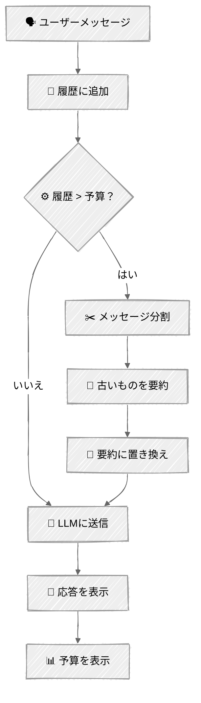

<!-- ---
title: "コンテキストエンジニアリング"
description: "トークンカウント、予算配分、自動圧縮で有限のコンテキストウィンドウを管理する"
icon: "layers"
--- -->

# コンテキストエンジニアリング

すべての会話には限界があります。[チャットのチュートリアル](../../01-foundations/03-chat/)では基本パターン——メッセージを追加してすべて送信する——を学びました。これはコンテキストウィンドウにぶつかるまでは機能します。このチュートリアルではエンジニアリングを追加します: トークンを測定し、予算を配分し、余裕がなくなったら自動的に圧縮します。

重要な洞察: コンテキストエンジニアリングは、より多くを詰め込むことではありません——何が最も重要かを決め、それを残すことです。

## 🎯 学べること

- リクエストを送る前に`client.messages.count_tokens()`を使って正確にトークンを数える
- システムプロンプト・会話履歴・応答の予約分にコンテキスト予算を配分する
- スライディングウィンドウ + 要約を実装し、古いメッセージを自動的に圧縮する
- 予算表示でコンテキスト使用量をリアルタイムに可視化する
- 異なる圧縮戦略のトレードオフを理解する

## 📦 利用可能なサンプル

| プロバイダー                                   | ファイル                                                                   | 説明                                                     |
| ---------------------------------------------- | -------------------------------------------------------------------------- | -------------------------------------------------------- |
|  | [01_context_engineering_anthropic.py](01_context_engineering_anthropic.py) | 予算管理を伴うインタラクティブチャット                   |
|  | [02_tool_context_anthropic.py](02_tool_context_anthropic.py)               | ツール出力のコンテキスト戦略（naive/truncate/summarize） |

## 🚀 クイックスタート

> **前提条件:** Python 3.11+、APIキー、uv。セットアップの詳細は [SETUP.md](../../SETUP.md) を参照してください。

```bash
uv run --directory 03-advanced-techniques/03-context-engineering python 01_context_engineering_anthropic.py
```

または、[Code Runner](https://marketplace.visualstudio.com/items?itemName=formulahendry.code-runner) VS Code拡張機能を使えば、開いているスクリプトをワンクリックで実行できます。

このデモでは意図的に低いコンテキスト予算（履歴用に約2,000トークン）を使用しているため、数回のやり取りの後に圧縮が発生する様子を確認できます。任意のトピックでチャットしてみましょう——予算表示は各ターンの後に更新されます。

## 🔑 キーコンセプト

### 1. トークンカウント

予算を管理する前に、まず測定する必要があります。Anthropicは正確なトークンカウントAPIを提供しています:

```python
result = client.messages.count_tokens(
    model="claude-sonnet-4-6",
    system="You are a research assistant.",
    messages=messages,
)
print(result.input_tokens)  # このリクエストの正確なトークン数
```

これはAPIが実際に数える方法と同じ方法でトークンを数えます——メッセージ整形によるオーバーヘッドも含みます。リクエストを送る前の事前チェックに使いましょう。

### 2. 予算配分

コンテキストウィンドウは単一のプールではありません——競合する複数のコンポーネントに分割されています:

```
┌────────────────────────────────┐
│                    コンテキストウィンドウ                      │
│                                                                │
│  ┌───────┐  ┌─────────┐  ┌──────┐  │
│  │  システム    │  │     会話履歴     │  │  応答      │  │
│  │  プロンプト  │  │     (可変)       │  │  予約分    │  │
│  │  (固定)      │  │                  │  │  (固定)    │  │
│  └───────┘  └─────────┘  └──────┘  │
│                                                                │
│  1度だけ測定          ← ここを管理する →    = max_tokens     │
└────────────────────────────────┘
```

```python
@dataclass
class ContextBudget:
    max_context: int          # ウィンドウ全体のサイズ
    system_tokens: int = 0    # 初期化時に測定
    response_reserve: int = 2048  # 応答用のmax_tokens

    @property
    def history_budget(self) -> int:
        return self.max_context - self.system_tokens - self.response_reserve
```

システムプロンプトは固定です——起動時に1度だけ測定します。応答の予約分は`max_tokens`パラメータです。残りすべてが履歴の予算になります。

### 3. 圧縮戦略: スライディングウィンドウ + 要約

履歴が予算を超えたら圧縮します:

```
圧縮前（予算超過）:
┌─────────────────────┐
│ msg1  msg2  msg3  msg4  msg5  msg6  msg7 │  ← 5000トークン
└─────────────────────┘

古いものと新しいものに分割:
┌──────────┐  ┌────────┐
│ msg1  msg2  msg3   │  │ msg6  msg7     │  ← 新しいものはそのまま保持
└──────────┘  └────────┘
         │
         ▼ LLMで要約
┌───────┐
│    要約      │  ← 約200トークンに圧縮
└───────┘

圧縮後（予算内）:
┌───────┐  ┌────────┐
│    要約      │  │ msg6  msg7     │  ← 1500トークン
└───────┘  └────────┘
```

要約は重要な事実と決定事項を保持します。最新のメッセージはそのまま保持されるため、モデルは最新のコンテキストについて完全な精度を持ちます。

### 4. 圧縮フロー

<!-- prettier-ignore -->


### 5. なぜ削除ではなく要約するのか

| 戦略               | 長所                   | 短所                             |
| ------------------ | ---------------------- | -------------------------------- |
| **古いものを削除** | シンプルで予測しやすい | コンテキストが恒久的に失われる   |
| **切り詰め**       | API呼び出し不要        | 途中で文が切れ、意味が失われる   |
| **要約**           | 重要な事実を保持       | 追加のAPI呼び出しがかかる        |

要約が最良のデフォルトです——モデルはトークン量をわずかに使うだけで、以前のトピックへの認識を保持できます。コストは圧縮ごとに1回の追加API呼び出しですが、会話の品質を維持するためには通常その価値があります。

### 6. コンテキストウィンドウのサイズ

参考までに、Claudeモデルごとのコンテキストウィンドウは以下の通りです:

| モデル            | コンテキストウィンドウ | 備考                           |
| ----------------- | ---------------------- | ------------------------------ |
| Claude Opus 4     | 200Kトークン           | 最も高性能、最大のコンテキスト |
| Claude Sonnet 4.5 | 200Kトークン           | 性能とコストのバランスが良い   |
| Claude Haiku 3.5  | 200Kトークン           | 最速で最もコスト効率が良い     |

本番環境では、実際のモデル上限に近い予算を設定するでしょう。このチュートリアルでは圧縮をすぐに確認できるよう4Kを使用しています。

### 7. ツール出力の戦略

エージェントシステムでは、ツール出力が最大のコンテキスト消費源です——単一のCRM検索や商品検索が1000トークン以上のJSONを返すこともあります。スクリプト02では、これを管理する3つの戦略を実演します:

```
生のツール出力（約1500トークン）:
┌────────────────────┐
│ { "orders": [ { "id": "ORD-9001",      │
│   "items": [ ... ], "total": ...       │
│   }, { "id": "ORD-8744", ...           │
│   }, ... 6 more orders ...             │
│ ] }                                    │
└────────────────────┘
   │               │               │
   ▼               ▼               ▼
 Naive          Truncate       Summarize
 (そのまま)      (文字数上限)    (LLM抽出)
 1500 tok       約150 tok       約200 tok
```

| 戦略          | 仕組み                               | コスト                               | リスク                                             |
| ------------- | ------------------------------------ | ------------------------------------ | -------------------------------------------------- |
| **Naive**     | 生のJSONを直接注入する               | ゼロ                                 | 2〜3回の呼び出しでコンテキストが埋まる             |
| **Truncate**  | N文字で切り詰め、`[TRUNCATED]`を追加 | ゼロ                                 | 末尾のデータが失われる——重要な情報が切れることも |
| **Summarize** | LLMが重要な事実を箇条書きに抽出する  | ツール使用ごとに追加のAPI呼び出し1回 | トークンはかかるが意味を保持する                   |

```python
def _process_tool_result(self, tool_name: str, raw_result: str) -> str:
    """ツール出力をコンテキストに注入する前に、選択した戦略を適用する。"""
    if self.strategy == "naive":
        return raw_result
    if self.strategy == "truncate":
        return self._truncate_result(raw_result)
    if self.strategy == "summarize":
        return self._summarize_result(tool_name, raw_result)
```

summarize戦略では、関連する事実のみを抽出するために焦点を絞ったシステムプロンプトを使用します:

```python
def _summarize_result(self, tool_name: str, result: str) -> str:
    response = self.client.messages.create(
        model=self.model,
        max_tokens=512,
        system="Extract the key facts from this tool output into a concise summary. "
               "Preserve all names, IDs, numbers, dates, and statuses.",
        messages=[{"role": "user", "content": f"Tool: {tool_name}\n\nOutput:\n{result}"}],
    )
    return response.content[0].text
```

## 🏗️ コード構造

### スクリプト01 — チャットコンテキスト（ContextManager）

```python
class ContextManager:
    """コンテキストウィンドウの配分と会話圧縮を管理する。"""

    def chat(self, user_input: str) -> str:
        """メッセージを追加 → 必要なら圧縮 → 送信 → 応答を返す。"""

    def _count_tokens(self, messages: list[dict]) -> int:
        """count_tokens APIによる事前トークン測定。"""

    def _compress_if_needed(self) -> None:
        """古いものと新しいものに分割 → 古いものを要約 → 置き換え。"""

    def _summarize_messages(self, messages: list[dict]) -> str:
        """メッセージブロックのLLMによる要約。"""

    def get_token_snapshot(self) -> TokenSnapshot:
        """可視化用の現在の予算状態。"""
```

### スクリプト02 — ツール出力コンテキスト（ToolContextAgent）

```python
class ToolContextAgent:
    """ツール出力のコンテキスト管理戦略を実演するエージェント。"""

    def chat(self, user_input: str) -> str:
        """エージェントループ: 送信 → ツール呼び出しの検知 → 実行 → 結果処理 → 繰り返す。"""

    def _process_tool_result(self, tool_name: str, raw_result: str) -> str:
        """ツール出力をコンテキストに注入する前に、選択した戦略を適用する。"""

    def _truncate_result(self, result: str) -> str:
        """TRUNCATE_MAX_CHARSで切り詰め、切り詰めを示すインジケーターを付ける。"""

    def _summarize_result(self, tool_name: str, result: str) -> str:
        """ツール出力から重要な事実を抽出するLLM呼び出し。"""

    def _count_tokens(self, messages: list[dict]) -> int:
        """count_tokens APIによる事前トークン測定。"""

    def _compress_if_needed(self) -> None:
        """古いものと新しいものに分割 → 古いものを要約 → 置き換え。"""

    def get_token_snapshot(self) -> TokenSnapshot:
        """可視化用の予算状態。"""
```

## ⚠️ 重要な考慮事項

- **トークンカウントのコスト** — `count_tokens()`は軽量なAPI呼び出しですが、それでもレイテンシがあります。本番環境では、カウントのキャッシュや、重要でないチェックにはtiktokenでの見積もりを検討しましょう。
- **要約の品質** — 要約は設計上、情報が失われます。細かい詳細が失われることもあります。あらゆる詳細が重要な会話では、より大きなコンテキストウィンドウや外部メモリの利用を検討してください。
- **交互に並ぶメッセージロール** — Anthropic APIはuser/assistantメッセージが交互に並ぶことを要求します。要約を（userメッセージとして）挿入した後、次のuserメッセージの前にassistantの確認応答が必要な場合があります。
- **圧縮の連鎖** — 何度も圧縮を重ねて要約自体が大きくなった場合、再要約が必要になることがあります。この実装は毎ターン予算をチェックするため、これを自然に処理します。
- **人為的な予算** — このデモの8K予算は意図的に小さく設定されています。Claudeの200Kコンテキストウィンドウを使う本番システムでは、圧縮の頻度ははるかに低くなります。

## 👉 次のステップ

コンテキストエンジニアリングをマスターしたら、次はこちらへ:
- **[コスト最適化](../04-cost-optimization/)** — プロンプトキャッシングとインテリジェントなモデルルーティングでAPIコストを削減する
- **実験** — `RECENT_MESSAGES_TO_KEEP`と`MAX_CONTEXT_TOKENS`を変更して、圧縮の挙動にどう影響するか確認してみましょう
- **探求** — 現在の要約を表示する「recall」コマンドを追加するか、異なる要約プロンプトを試してみましょう
