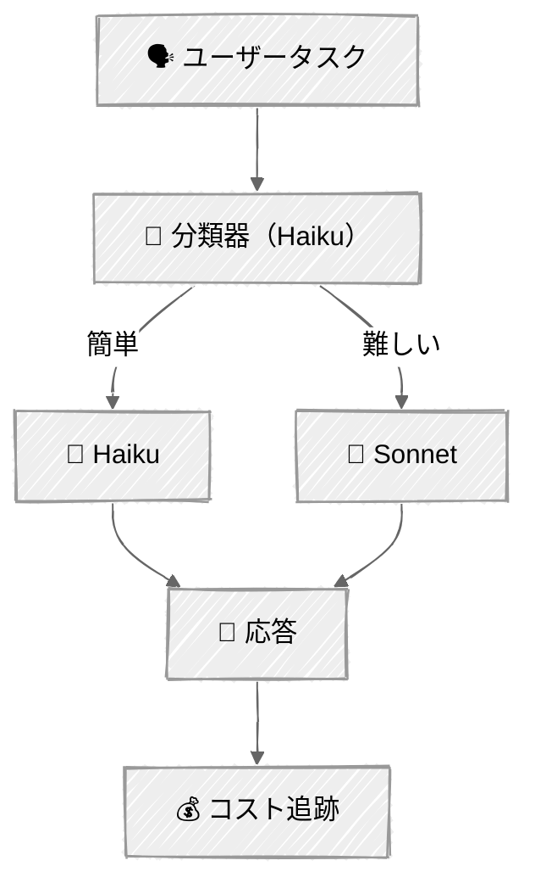

<!-- ---
title: "コスト最適化"
description: "プロンプトキャッシングとインテリジェントなモデルルーティングでAPIコストを削減する"
icon: "zap"
--- -->

# コスト最適化

[コンテキストエンジニアリングのチュートリアル](../03-context-engineering/)では、コンテキストウィンドウに*何が*収まるかを管理することを学びました。このチュートリアルでは別の課題に取り組みます: 送信するものの*コスト*を削減することです。互いに補完し合う2つの戦略——繰り返されるコンテンツをキャッシュしてコストを下げること、そしてタスクを処理できる最も安価なモデルにルーティングすることです。

## 🎯 学べること

- Anthropicのプロンプトキャッシングのために、明示的なキャッシュブレークポイントを付けてシステムプロンプトを構成する
- キャッシュのMISSとHITの仕組み、および5分間のTTLを理解する
- キャッシュメトリクスを追跡し、実際のコスト削減額を分析的に計算する
- 安価なモデルでタスクの難易度を分類するモデルルーターを構築する
- 複雑さに応じてタスクをHaiku（簡単）またはSonnet（難しい）にルーティングする
- ルーティングしたコストを、全てSonnetで処理した場合のベースラインと比較する

## 📦 利用可能なサンプル

| プロバイダー                                   | ファイル                                                          | 説明                                                             |
| ---------------------------------------------- | ----------------------------------------------------------------- | ---------------------------------------------------------------- |
|  | [01_prompt_caching_anthropic.py](01_prompt_caching_anthropic.py)  | キャッシュされたポリシー文書を使うカスタマーサポートエージェント |
|  | [02_model_routing_anthropic.py](02_model_routing_anthropic.py)    | 難易度ベースのルーティング（HaikuとSonnet）                      |

## 🚀 クイックスタート

> **前提条件:** Python 3.11+、APIキー、uv。セットアップの詳細は [SETUP.md](../../SETUP.md) を参照してください。

```bash
# プロンプトキャッシングのデモ
uv run --directory 03-advanced-techniques/04-cost-optimization python 01_prompt_caching_anthropic.py

# モデルルーティングのデモ
uv run --directory 03-advanced-techniques/04-cost-optimization python 02_model_routing_anthropic.py
```

または、[Code Runner](https://marketplace.visualstudio.com/items?itemName=formulahendry.code-runner) VS Code拡張機能を使えば、開いているスクリプトをワンクリックで実行できます。

## 🔑 キーコンセプト

### 1. プロンプトキャッシングの仕組み

Anthropicはプロンプトの*プレフィックス*をキャッシュします。最初の呼び出しはキャッシュに書き込みます（わずかな割増料金）。同じプレフィックスを持つ以降の呼び出しは、90%のコスト削減でキャッシュから読み込まれます。

```
呼び出し1 — キャッシュMISS:
┌──────────────────┐
│  System: instructions + policy     │ ──→ キャッシュに書き込み（1.25倍のコスト）
│  User: "What's the return policy?" │
└──────────────────┘

呼び出し2 — キャッシュHIT:
┌──────────────────┐
│  System: instructions + policy     │ ──→ キャッシュから読み込み（0.1倍のコスト！）
│  User: "How long is shipping?"     │
└──────────────────┘
```

キャッシュのTTLは5分で、HITのたびにリフレッシュされます。リクエストを送り続けている限り、キャッシュは温かい状態を保ちます。

### 2. キャッシュを意識したプロンプト設計

キャッシュの再利用を最大化するために、システムプロンプトを次のように構成します:

| ルール                             | 理由                                                                                  |
| ---------------------------------- | ------------------------------------------------------------------------------------- |
| **静的なコンテンツを先頭に**       | キャッシュはプレフィックスベース——安定したコンテンツ（ポリシー、指示）を先頭に置く  |
| **動的なコンテンツを末尾に**       | キャッシュされたプレフィックスより後のものはすべて全額課金される                      |
| **最小トークン数を超える**         | Sonnetはキャッシュされたブロックで1024トークン以上、Haikuは2048トークン以上を要求する |
| **明示的なブレークポイントを使う** | `cache_control: {"type": "ephemeral"}`が、何がキャッシュされるかを精密に制御する      |
| **TTLに注意する**                  | 5分間のウィンドウ——リクエストが十分な頻度で来ないとキャッシュは役立たない           |

```python
# システムプロンプトのブロックに明示的なキャッシュブレークポイントを付ける
system = [
    {"type": "text", "text": "Short instructions..."},
    {
        "type": "text",
        "text": large_policy_document,   # 1500トークン以上
        "cache_control": {"type": "ephemeral"},
    },
]
```

### 3. キャッシュメトリクスの読み方

Anthropicのすべての応答には、`usage`オブジェクトにキャッシュトークン数が含まれます:

```python
response = client.messages.create(model=model, system=system, messages=messages)

usage = response.usage
print(usage.input_tokens)                  # 入力トークンの合計
print(usage.cache_creation_input_tokens)   # キャッシュに書き込まれたトークン（MISS）
print(usage.cache_read_input_tokens)       # キャッシュから読み込まれたトークン（HIT）
```

最初の呼び出しでは`cache_creation_input_tokens > 0`になります。同じプレフィックスを持つ以降の呼び出しでは`cache_read_input_tokens > 0`になります——それが90%のコスト削減です。

### 4. キャッシュが逆効果になるケース

| アンチパターン                             | 問題                                                               |
| ------------------------------------------ | ------------------------------------------------------------------ |
| 毎回ユニークなプロンプト                   | 1.25倍の書き込み割増料金を払うが、キャッシュヒットは得られない     |
| システムプロンプトが1024トークン未満       | 最小値を下回る——Sonnetは全くキャッシュしない                     |
| リクエスト間隔が5分以上                    | 呼び出しの間にキャッシュが失効し、毎回書き込みになる               |
| 静的コンテンツより前に動的コンテンツがある | プレフィックスが壊れる——動的な部分の後ではキャッシュが一致しない |

### 5. モデルルーティング

すべてのタスクが最も高性能な（そして高価な）モデルを必要とするわけではありません。ルーティング層が各タスクを分類し、適切なモデルへ送ります:

<!-- prettier-ignore -->


分類器自体はHaiku（安価）で動作するため、オーバーヘッドは最小限です。分類のコストを含めても、簡単なタスクをHaikuにルーティングすることで、すべてをSonnetに送るのと比べて大幅な節約になります。

### 6. コスト比較

| モデル     | 入力（$/MTok） | 出力（$/MTok） | 最適な用途                     |
| ---------- | -------------- | -------------- | ------------------------------ |
| Haiku 4.5  | $1.00          | $5.00          | 事実の検索、簡単な計算、分類   |
| Sonnet 4.5 | $3.00          | $15.00         | 分析、設計、複数ステップの推論 |

Haikuの入力コストはSonnetより**67%安い**です。50%以上のタスクが単純なワークロードでは、ルーティングによってコストを大幅に削減できます。

## 🏗️ コード構造

### スクリプト01 — プロンプトキャッシング（CachedSupportAgent）

```python
class CachedSupportAgent:
    """プロンプトキャッシングを実演するカスタマーサポートエージェント。"""

    def _build_system(self) -> str | list[dict]:
        """cache_controlブロック付き、またはプレーンな文字列でシステムプロンプトを構築する。"""

    def chat(self, user_input: str) -> tuple[str, dict]:
        """メッセージを送信し、キャッシュメトリクスを追跡して(応答, usage_dict)を返す。"""

@dataclass
class CacheMetrics:
    """API呼び出し全体にわたるキャッシュパフォーマンスを追跡する。"""

    def record_call(...) -> None: ...
    def cost_with_caching(self) -> float: ...
    def cost_without_caching(self) -> float: ...     # すべてのトークンを基本入力レートで計算
    def savings(self) -> float: ...
    def cache_hit_rate(self) -> float: ...
```

### スクリプト02 — モデルルーティング（ModelRouter）

```python
class ModelRouter:
    """複雑さに応じてタスクを適切なモデルにルーティングする。"""

    def classify(self, task: str) -> str:
        """Haikuが「簡単」または「難しい」に分類する。"""

    def execute(self, task: str, model: str) -> tuple[str, int, int]:
        """指定されたモデルでタスクを実行する。"""

    def route_and_execute(self, task: str) -> TaskResult:
        """分類 → ルーティング → 実行 → コスト追跡。"""

    def get_summary(self) -> dict:
        """集計: ルーティング後の合計コスト、ベースラインコスト、節約額。"""
```

## ⚠️ 重要な考慮事項

- **キャッシュTTL** — Anthropicのプロンプトキャッシュは5分間のTTLです。そのウィンドウ内で複数のリクエストを行う場合にのみキャッシュが役立ちます。キャッシュがHITするたびにタイマーはリフレッシュされます。
- **書き込みの割増料金** — 最初の呼び出しはキャッシュされたトークンに対して1.25倍を支払います。書き込みコストの元を取るには、少なくとも4回のキャッシュヒットが必要です（読み込みは0.1倍なので）。
- **「キャッシュ解除」はできない** — 一度サーバー側でキャッシュされると、強制的にキャッシュミスにすることはできません。このスクリプトは、すべてのトークンを基本入力レートで扱うことで「キャッシュなしのコスト」を分析的に計算しています。
- **ルーティングの精度** — 分類器は完璧ではありません。まれな誤ルーティング（難しいタスク → Haiku）は低品質な応答を生む可能性があります。本番環境では、確信度の閾値やフォールバックロジックを追加しましょう。
- **価格の変更** — トークン価格は定数としてハードコードされています。最新の料金についてはAnthropicの価格ページを確認してください。
- **最小トークン閾値** — キャッシュブレークポイントには最小トークン数が必要です（Sonnetは1024、Haikuは2048）。閾値を下回るとキャッシングは黙って無効になります。

## 👉 次のステップ

コスト最適化を探求したら、次はこちらへ:
- **[メモリシステム](../05-memory/)** — セッションをまたいでエージェントに永続的なメモリを与える
- **実験** — 両方の戦略を組み合わせてみましょう: システムプロンプトをキャッシュし*かつ*タスクを異なるモデルにルーティングする
- **探求** — 3番目のルーティング階層を追加する（例: 最も難しいタスク向けにOpus）か、確信度ベースのフォールバックを実装してみましょう
