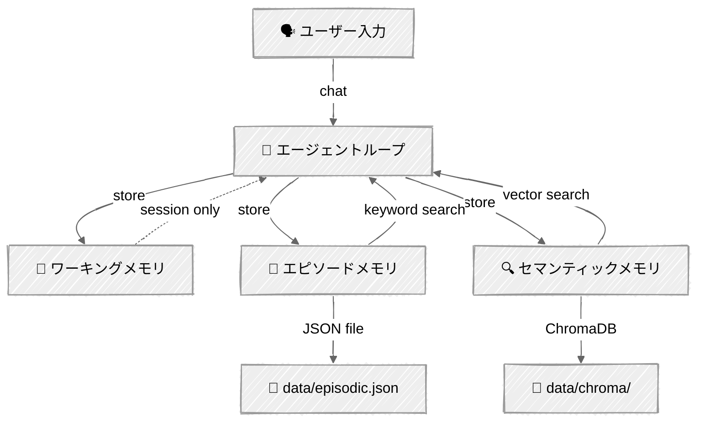

<!-- ---
title: "メモリシステム"
description: "エージェントに永続的なメモリを与える——ワーキングバッファ、エピソードイベント、セッションをまたぐセマンティック知識"
icon: "database"
--- -->

# メモリシステム

セッションをまたいで持続するメモリをエージェントに与えます。このチュートリアルは[コンテキストエンジニアリング](../03-context-engineering/)（単一セッションのコンテキストウィンドウの管理）の上に構築され、**永続性**を追加します——エージェントがあなたが誰か、何を伝えたか、以前の会話で何が起きたかを記憶するようになります。

人間の認知にヒントを得た3階層のメモリアーキテクチャを実装します: ワーキングメモリ（短期バッファ）、エピソードメモリ（タイムスタンプ付きイベント）、セマンティックメモリ（ベクトルデータベース内の事実と知識）です。

## 🎯 学べること

- ワーキング・エピソード・セマンティックのメモリ階層を区別する
- セッション状態のための重要度ベースの追い出しバッファを構築する
- キーワード検索付きでタイムスタンプ付きイベントをJSONファイルに永続化する
- ChromaDBの組み込み埋め込みとコサイン類似度を使って事実を保存・検索する
- ランク付けされた結果で階層をまたいだメモリ検索をオーケストレーションする
- コンテキストを意識した応答のために、想起したメモリをシステムプロンプトに注入する
- LLM抽出を使って会話を長期記憶に統合する

## 📦 利用可能なサンプル

| プロバイダー                                   | ファイル                                                                       | 説明                                               |
| ---------------------------------------------- | ------------------------------------------------------------------------------ | -------------------------------------------------- |
|  | [01_memory_agent_anthropic.py](01_memory_agent_anthropic.py)                   | 階層化されたメモリを持つパーソナルアシスタント     |
|  | [02_memory_inspector_anthropic.py](02_memory_inspector_anthropic.py)           | メモリブラウザ/インスペクター（LLM呼び出しなし）   |

## 🚀 クイックスタート

> **前提条件:** Python 3.11+、APIキー、uv。セットアップの詳細は [SETUP.md](../../SETUP.md) を参照してください。

```bash
# メモリエージェント — チャットして永続的なメモリを構築する
uv run --directory 03-advanced-techniques/05-memory python 01_memory_agent_anthropic.py

# メモリインスペクター — 保存されたメモリを閲覧・管理する
uv run --directory 03-advanced-techniques/05-memory python 02_memory_inspector_anthropic.py
```

または、[Code Runner](https://marketplace.visualstudio.com/items?itemName=formulahendry.code-runner) VS Code拡張機能を使えば、開いているスクリプトをワンクリックで実行できます。

## 🔑 キーコンセプト

### 1. 3階層メモリアーキテクチャ

エージェントには目的に応じて異なる種類のメモリが必要です——人間が「今考えていること」「最近起きたこと」「事実として知っていること」を区別するのと同じです。



| 階層               | 目的                           | ストレージ       | 寿命       | 検索方法             |
|--------------------|--------------------------------|------------------|------------|----------------------|
| **ワーキング**     | 現在のセッションのコンテキスト | メモリ内リスト   | セッション | 直接アクセス         |
| **エピソード**     | イベントとやり取り             | JSONファイル     | 永続       | キーワードマッチング |
| **セマンティック** | 事実と知識                     | ChromaDBベクトル | 永続       | コサイン類似度       |

### 2. メモリのライフサイクル

すべてのメモリは予測可能なライフサイクルを流れます:

**キャプチャ** → エージェントが何かを記憶する価値があると判断する（ツール呼び出しまたは統合を通して）

**保存** → コンテンツの種類に応じて適切な階層にルーティングされる

**検索** → 階層をまたいだ検索がキーワードとベクトルの結果を組み合わせ、`類似度 × 重要度`でランク付けする

**統合** → セッション終了時、LLMが会話から重要な項目を抽出して永続ストレージに保存する

**忘却** → ツール呼び出しによる明示的な削除、またはバッファが満杯になったときのワーキングメモリの追い出し

### 3. エピソードメモリ vs セマンティックメモリ

**エピソードメモリ**は*何が起きたか*を保存します——タイムスタンプ付きのイベントです:

```python
# 「ユーザーは自分の名前をAlexだと教えてくれた」——起きた出来事
episodic.save(MemoryEntry(
    content="User introduced themselves as Alex, works at Acme Corp",
    importance=0.8,
))

# キーワード検索 — 一致する単語を含むエントリを見つける
results = episodic.search("Alex")  # 一致するMemoryEntryオブジェクトを返す
```

**セマンティックメモリ**は*何が知られているか*を保存します——事実と好みです:

```python
# 「AlexはPythonを好む」——出来事ではなく事実
semantic.save(MemoryEntry(
    content="User prefers Python over JavaScript for backend development",
    importance=0.7,
))

# ベクトル検索 — 異なる単語でも意味的に類似するエントリを見つける
results = semantic.search("programming language preferences")
# [(MemoryEntry, 類似度スコア), ...] を返す
```

### 4. メモリ拡張プロンプト

重要なパターン: 想起したメモリをシステムプロンプトに注入し、ユーザーが話し始める前からLLMがコンテキストを持てるようにします。

```python
def _build_system_prompt(self) -> str:
    """想起したメモリをシステムプロンプトに注入する。"""
    memory_context = self.memory.build_memory_context()
    return SYSTEM_PROMPT.format(memory_context=memory_context)
```

`build_memory_context()`メソッドは最近のエピソードイベントと上位のセマンティックな事実を取得し、LLMが自然に参照できるMarkdownセクションとして整形します。

### 5. エージェント主導のメモリ（3つのツール）

いつメモリを保存するかをハードコードする代わりに、エージェントに**ツール**を与えて判断させます:

```python
MEMORY_TOOLS = [
    {"name": "remember", ...},  # 重要度スコア付きでいずれかの階層に保存
    {"name": "recall", ...},    # クエリによる階層横断検索
    {"name": "forget", ...},    # IDと階層で削除
]
```

エージェントはシステムプロンプトの指示を通じて、各ツールをいつ使うべきかを学習します。ユーザーが重要な情報を共有したときは`remember`を呼び出し、既存の知識を確認するには`recall`を、何かを削除するよう頼まれたときは`forget`を呼び出します。

### 6. セッション統合

各セッションの終わりに、エージェントは会話を振り返り、重要な項目を永続ストレージに抽出します:

```python
saved = agent.memory.consolidate(agent.messages, agent.client, MODEL)
# LLMが会話を分析 → 事実/イベントを抽出 → エピソード + セマンティックに保存
```

これにより、会話中にエージェントが明示的に`remember`しなかった情報も拾われ、セッション間で重要なものが失われないようにします。

## 🏗️ コード構造

```
05-memory/
├── memory/
│   ├── __init__.py       # パッケージのエクスポート
│   ├── models.py         # MemoryEntryデータクラス、MemoryType列挙型
│   ├── working.py        # WorkingMemory — 追い出し機能付きセッションバッファ
│   ├── episodic.py       # EpisodicMemory — JSONバックエンドのイベントストア
│   ├── semantic.py       # SemanticMemory — ChromaDBベクトルストア
│   └── manager.py        # MemoryManager — 全階層をオーケストレーションする
├── 01_memory_agent_anthropic.py    # メモリツールを持つパーソナルアシスタント
└── 02_memory_inspector_anthropic.py # メモリブラウザ（LLMなし）
```

| クラス           | 主なメソッド                                                                    |
|------------------|---------------------------------------------------------------------------------|
| `WorkingMemory`  | `add()`, `get_recent()`, `get_important()`, `clear()`                           |
| `EpisodicMemory` | `save()`, `search()`, `get_recent()`, `delete()`                                |
| `SemanticMemory` | `save()`, `search()`, `delete()`, `list_all()`                                  |
| `MemoryManager`  | `remember()`, `recall()`, `forget()`, `build_memory_context()`, `consolidate()` |
| `MemoryAgent`    | `chat()`, `_build_system_prompt()`, `_execute_tool()`                           |

## ⚠️ 重要な考慮事項

- **ChromaDBの初回ダウンロード** — ChromaDBは初回使用時に小さな埋め込みモデル（約80MB）をダウンロードします。以降の実行ではキャッシュされたモデルを使用します。
- **無制限の増加** — エピソードメモリとセマンティックメモリは制限なく増加します。本番環境では保持ポリシーやサイズ上限を追加しましょう。
- **統合のコスト** — セッション終了時の`consolidate()`呼び出しは追加のLLM API呼び出しを1回行います。非常に短いセッションではスキップしましょう。
- **埋め込みの品質** — ChromaDBのデフォルトの埋め込みは短い事実に対してはうまく機能します。より長いドキュメントや高い精度が必要な場合は、専用の埋め込みモデルを検討してください。
- **暗号化なし** — メモリは平文のJSONとChromaDBファイルに保存されます。機密情報（パスワード、トークン）をエージェントメモリに保存しないでください。

## 👉 次のステップ

- **[RAGテクニック](../06-rag-techniques/)** — ハイブリッド検索とエージェント型検索を使ったRetrieval-Augmented Generationパイプラインを構築する
- **試してみる実験:**
  - 30日より古いエピソードメモリを自動削除する保持ポリシーを追加する
  - メモリ要約を実装する——古いエピソードエントリをセマンティックな事実に圧縮する
  - 4番目の階層を追加する: 学習したワークフローやルーティンのための手続き記憶
  - ユーザーIDごとに別々のストアを持つマルチユーザーメモリシステムを構築する
