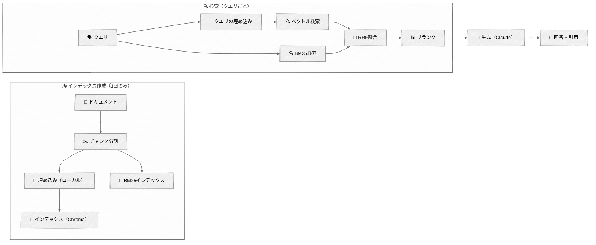
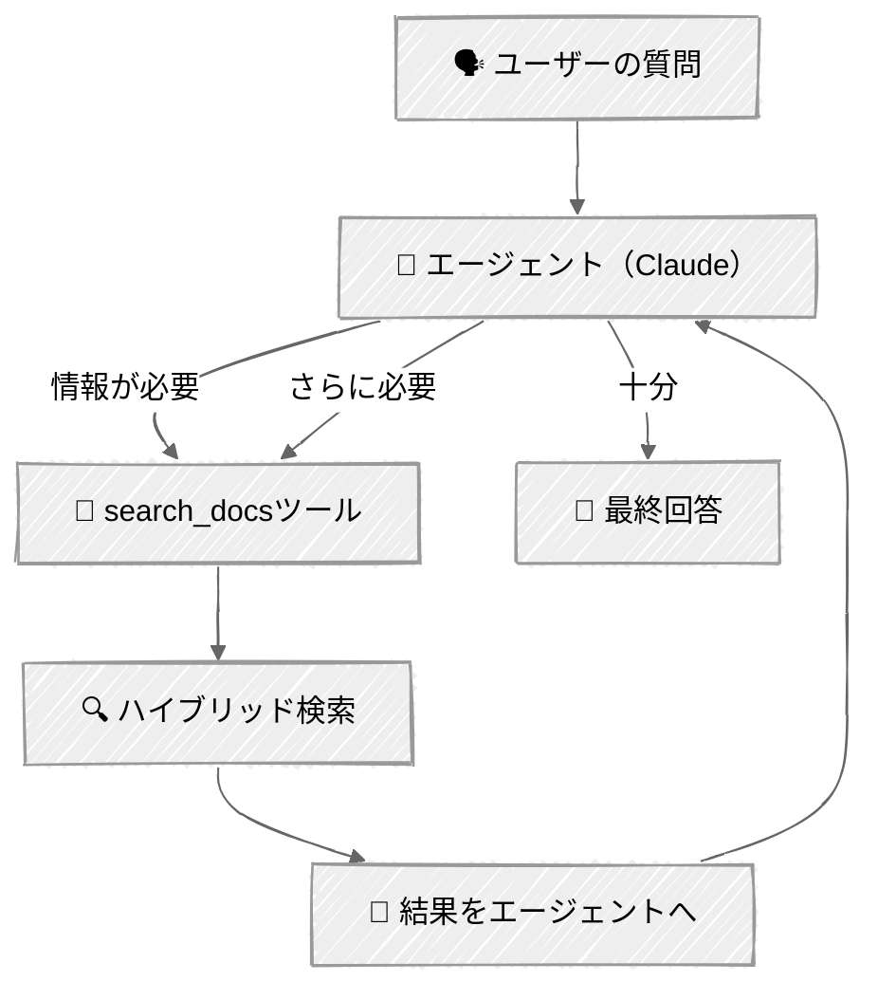

<!-- ---
title: "RAGテクニック"
description: "ハイブリッド検索、リランキング、エージェント型検索を使ったRetrieval-Augmented Generationパイプラインを構築する"
icon: "search"
--- -->

# RAGテクニック

ほとんどのAIエージェントは、モデルが学習していない情報——社内ドキュメント、製品マニュアル、コードベース——について質問に答える必要があります。RAG（Retrieval-Augmented Generation）はそのギャップを埋めます: ナレッジベースから関連するコンテキストを検索し、質問と一緒にモデルに渡します。

しかし、素朴なRAG（すべてを埋め込み、上位5件を検索し、うまくいくことを祈る）には、よく知られた失敗パターンがあります。このチュートリアルでは、RAGを実際に機能させるエンジニアリング——ハイブリッド検索、リランキング、そしてエージェントがいつ何を検索するかを判断するエージェント型検索——を学びます。

## 🎯 学べること

- 完全なRAGパイプラインを構築する: 取り込み、チャンク分割、埋め込み、インデックス作成、検索、生成
- ローカルのsentence-transformer埋め込みを使う（APIキー不要）
- BM25キーワード検索とベクトル検索を、reciprocal rank fusionを使って組み合わせる
- FlashRankでAPIコストをかけずに結果をリランクし、精度を高める
- エージェントがツールとして検索を制御するエージェント型RAGシステムを構築する
- RAGを使うべきか、単にすべてをコンテキストウィンドウに詰め込むべきかを理解する

## 📦 利用可能なサンプル

| プロバイダー                                   | ファイル                                                          | 説明                                        |
| ---------------------------------------------- | ----------------------------------------------------------------- | ------------------------------------------- |
|  | [01_rag_pipeline_anthropic.py](01_rag_pipeline_anthropic.py)      | ハイブリッド検索を伴う完全なRAGパイプライン |
|  | [02_agentic_rag_anthropic.py](02_agentic_rag_anthropic.py)        | tool_useを使ったエージェント制御の検索      |

## 🚀 クイックスタート

> **前提条件:** Python 3.11+、APIキー、uv。セットアップの詳細は [SETUP.md](../../SETUP.md) を参照してください。

このチュートリアルは1つのAPIキーを必要とします:
- `ANTHROPIC_API_KEY` — Claude用（生成）

埋め込みは`sentence-transformers`（all-MiniLM-L6-v2、初回実行時に約80MBのダウンロード）を使ってローカルで実行されます。

```bash
# RAGパイプラインのデモ
uv run --directory 03-advanced-techniques/06-rag-techniques python 01_rag_pipeline_anthropic.py

# エージェント型RAGのデモ
uv run --directory 03-advanced-techniques/06-rag-techniques python 02_agentic_rag_anthropic.py
```

または、[Code Runner](https://marketplace.visualstudio.com/items?itemName=formulahendry.code-runner) VS Code拡張機能を使えば、開いているスクリプトをワンクリックで実行できます。

初回実行では埋め込みモデル（約80MB）とリランキングモデル（約4MB）がダウンロードされ、サンプルドキュメントの埋め込みが作成されます。以降の実行では、永続化されたChromaDBインデックスから読み込まれます。

## 🔑 キーコンセプト

### 1. RAGを使うべきとき

すべてのアプリケーションにRAGが必要なわけではありません。判断は、ナレッジベースのサイズと更新頻度によります:

| シナリオ                         | アプローチ               | 理由                                                           |
| -------------------------------- | ------------------------ | -------------------------------------------------------------- |
| ナレッジベースが20万トークン未満 | コンテキストへの詰め込み | すべてプロンプトに入れるだけ——よりシンプルで信頼性が高い     |
| 静的な知識、多数のクエリ         | RAG                      | 埋め込みコストを多数のクエリに分散させる                       |
| 頻繁に更新される知識             | RAG                      | 再学習なしで変更されたドキュメントを再インデックスする         |
| モデルが出典を引用する必要がある | RAG                      | 検索されたチャンクが自然な出典帰属を提供する                   |
| 一般的な知識に関する質問         | RAG不要                  | モデルはすでに知っている——持っているものを検索する必要はない |

### 2. RAGパイプライン

<!-- prettier-ignore -->


### 3. チャンク分割

ドキュメントは、埋め込むには十分小さく、意味を保つには十分大きいチャンクに分割されます。ここでは再帰的分割を使います——文字分割にフォールバックする前に、自然な境界（段落、次に行、次に文）を試みます:

```python
chunks = recursive_split(
    text,
    source="api_reference.md",
    chunk_size=512,      # 目標サイズ（文字数）
    chunk_overlap=64,    # オーバーラップにより境界での文脈喪失を防ぐ
)
```

なぜ再帰的分割なのか？ ドキュメントの構造を尊重するからです。段落の区切りは、文の途中よりも良い分割ポイントです。オーバーラップにより、2つのチャンクにまたがる情報が失われないようにします。

### 4. 埋め込み

[sentence-transformers](https://www.sbert.net/)の`all-MiniLM-L6-v2`モデルを使用します——APIキー不要でローカルで動作する軽量な（約80MB）モデルです。意味検索に適した384次元の埋め込みを生成します:

```python
from sentence_transformers import SentenceTransformer

model = SentenceTransformer("all-MiniLM-L6-v2")

# インデックス作成のためにドキュメントを埋め込む
doc_embeddings = model.encode(["document text here", ...])

# 検索のためにクエリを埋め込む
query_embedding = model.encode("search query")
```

より高い精度要件を持つ本番ワークロードでは、Voyage AIやOpenAIの埋め込みのようなAPIベースの埋め込みプロバイダーを検討してください——より大きなモデルと、検索品質を向上させうるドキュメント/クエリの区別を提供します。

### 5. ハイブリッド検索が必要な理由

ベクトル検索は意味的に類似したコンテンツを見つけますが、完全一致を見逃すことがあります。BM25キーワード検索は正確な用語を見つけますが、言い換えを見逃します。両方を組み合わせることで、どちらか一方だけでは見逃すものを捕捉できます:

```
クエリ: "What is the rate limit for the Pro plan?"

ベクトル検索が見つけるもの:
  ✓ "Rate limits are enforced per API key..."     （意味的な一致）
  ✗ リストに埋もれた正確な「Pro plan」の言及を見逃す

BM25検索が見つけるもの:
  ✓ "Pro plan: 500 requests/minute, 50,000/day"   （正確なキーワード一致）
  ✗ 意味的に関連するレート制限の概念を見逃す

ハイブリッド（両方 + RRF融合）:
  ✓ 両方を返す——いいとこ取り
```

**Reciprocal Rank Fusion（RRF）**は2つのランク付きリストをマージします。各アイテムのスコア = `1/(k + rank)`をリスト全体で合計したものです。両方のリストに現れるアイテムはより高いスコアになります。定数`k=60`（元の論文より）はランク位置の影響を緩和します。

### 6. リランキング

多くの候補（20件以上）を検索し、上位5件にリランクします。リランカー（クロスエンコーダーモデル）は各クエリ・ドキュメントのペアを直接スコアリングします——これはベクトル類似度より正確ですが、コレクション全体に対して実行するには遅すぎます:

```
リランク前（RRFスコアによる）:
  1. Generic rate limiting overview        ← 関連するが具体性がない
  2. Pro plan: 500 req/min, 50,000/day     ← まさに欲しい情報
  3. Authentication methods                ← 無関係
  4. Rate limit error handling (429)       ← 部分的に関連
  5. Enterprise plan details               ← 違うプラン

リランク後（クロスエンコーダーの関連度による）:
  1. Pro plan: 500 req/min, 50,000/day     ← トップに昇格
  2. Rate limit error handling (429)       ← 有用なコンテキスト
  3. Generic rate limiting overview        ← 補足情報
```

[FlashRank](https://github.com/PrithivirajDamodaran/FlashRank)——APIキー不要でCPU上で動作する軽量なリランカー（約4MBのONNXモデル）を使用します。

### 7. パイプラインRAG vs エージェント型RAG

スクリプト01は**パイプライン**です——どの質問も同じ検索→生成のフローを実行します。スクリプト02は**エージェント**です——LLMが検索を使うかどうか、どう使うかを判断します:

| 観点                 | パイプラインRAG                 | エージェント型RAG                      |
| -------------------- | ------------------------------- | -------------------------------------- |
| 検索のトリガー       | すべての質問                    | エージェントが判断                     |
| 検索クエリ           | ユーザーの質問そのまま          | エージェントが自分でクエリを組み立てる |
| 複数ステップの検索   | 非対応                          | エージェントは複数回検索できる         |
| フォローアップの質問 | それぞれ独立                    | エージェントが会話コンテキストを使う   |
| 複雑さ               | シンプルで予測可能              | より柔軟だが予測しにくい               |
| 最適な用途           | 単発のQ&A、検索インターフェース | 対話型アシスタント、複雑なクエリ       |

<!-- prettier-ignore -->


## 🏗️ コード構造

### `rag/`パッケージ

```python
# rag/chunker.py
def recursive_split(text, source, chunk_size=512, chunk_overlap=64) -> list[Chunk]: ...

# rag/embedder.py
class LocalEmbedder:
    def embed_documents(self, texts: list[str]) -> list[list[float]]: ...
    def embed_query(self, query: str) -> list[float]: ...

# rag/store.py
class VectorStore:
    def add_chunks(self, chunks: list[Chunk]) -> None: ...
    def vector_search(self, query: str, top_k: int) -> list[tuple[Chunk, float]]: ...
    def keyword_search(self, query: str, top_k: int) -> list[tuple[Chunk, float]]: ...

# rag/retriever.py
class HybridRetriever:
    def retrieve(self, query: str, top_k: int = 5) -> list[Chunk]: ...

# rag/reranker.py
class Reranker:
    def rerank(self, query: str, chunks: list[Chunk], top_k: int) -> list[Chunk]: ...
```

### スクリプト01 — パイプラインRAG（RAGPipeline）

```python
class RAGPipeline:
    def ingest(self, docs_dir: Path) -> int: ...
    def query(self, question: str) -> tuple[str, list[Chunk]]: ...
```

### スクリプト02 — エージェント型RAG（AgenticRAG）

```python
class AgenticRAG:
    def chat(self, user_input: str, console: Console) -> str: ...
```

## ⚠️ 重要な考慮事項

- **APIキーは1つだけ必要** — Claude用の`ANTHROPIC_API_KEY`。埋め込みはAPIキーなしでローカルで実行されます。
- **初回実行時のセットアップ** — 初回実行では埋め込みモデル（約80MB）とFlashRankリランカー（約4MB）がダウンロードされ、埋め込みが作成されます。以降の実行では永続化された`.chroma_db/`ディレクトリから読み込まれます。再インデックスを強制するには`.chroma_db/`を削除してください。
- **埋め込みの品質 > 検索のテクニック** — 悪い埋め込みは、より良い検索戦略では救えません。検索を調整する前に、まず良い埋め込みモデルから始めましょう。
- **チャンクサイズのトレードオフ** — 小さいチャンク（256）はより精密な検索を提供しますが、コンテキストが失われます。大きいチャンク（1024）はコンテキストを保持しますが、精度が下がります。512は実用的なデフォルトです。
- **規模拡大時のコスト** — 埋め込みコストは（インデックス作成時の）1回限りです。検索は無料です（ローカルのChromaDB + BM25）。クエリごとに料金がかかるのは生成呼び出しだけです。
- **本番環境での考慮事項** — このチュートリアルはファイルベースのChromaDBを使用します。本番環境では、マネージド型ベクトルデータベース（Pinecone、Weaviate）やバッチ価格を持つホスト型埋め込みAPIを検討してください。

## 👉 次のステップ

RAGパイプラインを構築したら、次はこちらへ:
- **[マルチモーダル](../07-multimodal/)** — テキストと並行して画像を処理し、ビジュアルを生成し、音声を扱う
- **実験** — 異なるチャンクサイズ（256 vs 512 vs 1024）を試し、検索品質を比較してみましょう
- **探求** — `sample_docs/`に自分のドキュメントを追加し、パイプラインがどう扱うか確認してみましょう
- **発展** — チャンクを埋め込む前にドキュメントレベルのコンテキストで補強するテクニックについて、[AnthropicのContextual Retrieval](https://www.anthropic.com/news/contextual-retrieval)を読んでみましょう
