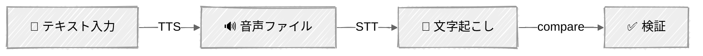

<!-- ---
title: "マルチモーダルエージェント"
description: "テキストと並行して画像を処理し、ビジュアルを生成し、音声を扱う"
icon: "image"
--- -->

# マルチモーダルエージェント

テキストのみのエージェントの先へ進みましょう。このチュートリアルでは3つのコアなマルチモーダルスキル——画像理解（視覚）、画像生成、音声（テキスト読み上げ + 音声認識）——を、それぞれ最適なプロバイダーを使って学びます。

## 🎯 学べること

- URLとbase64ソースを使ってClaudeに画像を送信し、視覚的な分析を行う
- 1回のリクエストで複数の画像を比較する
- MIMEタイプを検出し、視覚APIのためにローカルファイルをエンコードする
- Geminiのネイティブ画像生成を使ってテキストプロンプトから画像を生成する
- `response_modalities`を使ってテキストと画像が混在した出力をリクエストする
- OpenAIの6種類の声でテキストを音声に変換する
- Whisperで音声ファイルを文字起こしする
- 往復の忠実度を検証する: テキスト → 音声 → 文字起こし → 比較

## 📦 利用可能なサンプル

| プロバイダー                                   | ファイル                                                       | 説明                                 |
| ---------------------------------------------- | -------------------------------------------------------------- | ------------------------------------ |
|  | [01_vision_anthropic.py](01_vision_anthropic.py)               | Claudeの視覚機能による画像解析       |
|        | [02_image_generation_gemini.py](02_image_generation_gemini.py) | Geminiによるネイティブ画像生成       |
|        | [03_audio_openai.py](03_audio_openai.py)                       | テキスト読み上げと音声認識           |

## 🚀 クイックスタート

> **前提条件:** Python 3.11+、APIキー、uv。セットアップの詳細は [SETUP.md](../../SETUP.md) を参照してください。

```bash
# Vision — Claudeで画像を解析する
uv run --directory 03-advanced-techniques/07-multimodal python 01_vision_anthropic.py

# Image Generation — Geminiで画像を生成する
uv run --directory 03-advanced-techniques/07-multimodal python 02_image_generation_gemini.py

# Audio — OpenAIでテキスト読み上げと文字起こしを行う
uv run --directory 03-advanced-techniques/07-multimodal python 03_audio_openai.py
```

または、[Code Runner](https://marketplace.visualstudio.com/items?itemName=formulahendry.code-runner) VS Code拡張機能を使えば、開いているスクリプトをワンクリックで実行できます。

## 🔑 キーコンセプト

### 1. 画像入力の形式

Claudeは2種類の形式で画像を受け付けます——URL参照またはbase64エンコードです:

```python
# URLソース — Claudeが直接画像を取得する
{"type": "image", "source": {"type": "url", "url": "https://example.com/photo.jpg"}}

# Base64ソース — 画像データがインラインで送信される
{"type": "image", "source": {"type": "base64", "media_type": "image/jpeg", "data": "<base64>"}}
```

対応形式: JPEG、PNG、GIF、WebP。画像は1568×1568px以内に収まるようリサイズされます。

### 2. 視覚APIのパターン

画像はmessages配列内で、テキストと並ぶコンテンツブロックとして送信されます:

```python
response = client.messages.create(
    model="claude-sonnet-4-6",
    max_tokens=2048,
    messages=[{
        "role": "user",
        "content": [
            {"type": "image", "source": {"type": "url", "url": image_url}},
            {"type": "text", "text": "Describe this image."},
        ],
    }],
)
```

複数画像の比較では、画像ブロックとテキストラベルを交互に並べます:

```python
content = [
    {"type": "text", "text": "Image 1:"},
    {"type": "image", "source": {"type": "url", "url": url_1}},
    {"type": "text", "text": "Image 2:"},
    {"type": "image", "source": {"type": "url", "url": url_2}},
    {"type": "text", "text": "Compare these two images."},
]
```

### 3. 画像生成

Geminiはユニークです——理解と生成の両方をこなす単一のモデルです。`response_modalities`を設定することで画像出力をリクエストできます:

```python
from google import genai
from google.genai import types

client = genai.Client()  # 環境変数からGOOGLE_API_KEYを読み込む

response = client.models.generate_content(
    model="gemini-2.0-flash-exp-image-generation",
    contents="A mountain landscape at sunrise",
    config=types.GenerateContentConfig(response_modalities=["TEXT", "IMAGE"]),
)

# レスポンスのpartsにはテキストや inline_data（画像バイト列）が含まれる
for part in response.candidates[0].content.parts:
    if part.inline_data:
        Path("output.png").write_bytes(part.inline_data.data)
```

### 4. 音声パイプライン



OpenAIは各方向に対して個別のエンドポイントを提供しています:

```python
# テキスト → 音声（TTS）
response = client.audio.speech.create(model="tts-1", voice="alloy", input="Hello!")
response.write_to_file("output.mp3")

# 音声 → テキスト（STT / Whisper）
with open("output.mp3", "rb") as f:
    result = client.audio.transcriptions.create(model="whisper-1", file=f)
print(result.text)
```

### 5. マルチモーダルのトークンコスト

| コンテンツの種類             | おおよそのコスト |
| ---------------------------- | ---------------- |
| 1568×1568画像（最大サイズ） | 約1,600トークン  |
| 768×768画像                 | 約400トークン    |
| テキスト（1単語）            | 約1.3トークン    |
| 音声TTS（1,000文字）         | $0.015           |
| 音声STT（1分）               | $0.006           |

### 6. プロバイダー選択ガイド

| タスク           | 最適なプロバイダー      | 理由                                                   |
| ---------------- | ----------------------- | ------------------------------------------------------ |
| 画像解析 / OCR   | **Anthropic**（Claude） | 最高クラスの視覚性能、クリーンなコンテンツブロックAPI  |
| 画像生成         | **Gemini**              | ネイティブ生成——単一モデル、別エンドポイント不要     |
| テキスト読み上げ | **OpenAI**              | 6種類の異なる声、成熟したTTS API                       |
| 音声認識         | **OpenAI**（Whisper）   | 業界標準の文字起こし精度                               |
| 動画理解         | **Gemini**              | ネイティブな動画入力対応（最大1時間）                  |

## 🏗️ コード構造

各スクリプトは標準パターンに従っています: LLM/APIロジックをカプセル化するクラス、インタラクティブなメニュー駆動の`main()`。

| スクリプト                      | クラス           | 主なメソッド                                                    |
| ------------------------------- | ---------------- | --------------------------------------------------------------- |
| `01_vision_anthropic.py`        | `VisionAnalyst`  | `analyze_url()`, `analyze_file()`, `compare_images()`           |
| `02_image_generation_gemini.py` | `ImageGenerator` | `generate()`, `save_image()`                                    |
| `03_audio_openai.py`            | `VoiceAssistant` | `speak()`, `transcribe()`, `round_trip()`, `voice_comparison()` |

## ⚠️ 重要な考慮事項

- **画像のトークンコスト** — 各画像は解像度に応じて400〜1,600トークンかかります。複数画像のリクエストではこれがすぐに増えます。
- **音声ファイルのサイズ** — TTSはMP3ファイルを生成します（1文あたり約32KB）。Voice comparisonは一度に6ファイルを作成します。出力ファイルは`output/`に保存されます。
- **生成品質** — Geminiの画像生成は実験的です。結果にばらつきがあり、モデルが時々リクエストを拒否することがあります。
- **レート制限** — 画像・音声APIはテキストより厳しいレート制限があります。本番環境ではリクエスト間に遅延を追加しましょう。
- **音声にはトークン追跡がない** — OpenAIの音声APIは、トークンではなく文字数（TTS）と分数（STT）で課金されます。音声スクリプトの代わりにAPI呼び出し回数を追跡します。

## 👉 次のステップ

- **[ガードレール](../08-guardrails/)** — 本番エージェントのために入出力の安全性レイヤーを追加する
- **試してみる実験:**
  - 画像編集を追加する: Geminiに画像 + テキストプロンプトを送って編集させる
  - ビジュアルQ&Aループを構築する: 画像をアップロードし、それについてフォローアップの質問をする
  - モダリティを連鎖させる: 画像を解析 → 説明を生成 → それを読み上げる
  - 多言語対応のためにWhisperの文字起こしに言語検出を追加する
