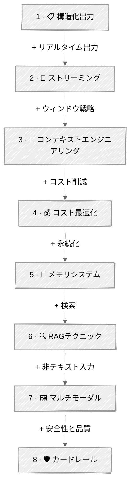

<!-- ---
title: "高度なテクニック"
description: "エージェントがプロトタイプ段階を抜け出した瞬間に直面する、実践的なエンジニアリング課題を1チュートリアルずつ解決する"
--- -->

# 高度なテクニック

エージェントがプロトタイプ段階を抜け出した瞬間に直面する、実践的なエンジニアリング課題。コンテキスト制限、コスト、メモリ、マルチモーダル入力——1チュートリアルずつ解決していきます。

> **近日公開** — このモジュールは現在開発中です。[Substackを購読](https://agenticloopsai.substack.com)するか、リポジトリにスターを付けて、チュートリアル公開時の通知を受け取ってください。

## 🗺️ 進行パス

| ステップ | チュートリアル | 追加される要素 |
|:----:|----------|-------------|
| 1 | [構造化出力](01-structured-output/) | JSONスキーマ、Pydanticバリデーション |
| 2 | [ストリーミング](02-streaming/) | + トークン単位の出力、ストリーミングツール呼び出し |
| 3 | [コンテキストエンジニアリング](03-context-engineering/) | + トークンカウント、予算配分、圧縮 |
| 4 | [コスト最適化](04-cost-optimization/) | + プロンプトキャッシング、モデルルーティング |
| 5 | [メモリシステム](05-memory/) | + ワーキング・エピソード・セマンティックメモリ |
| 6 | [RAGテクニック](06-rag-techniques/) | + ハイブリッド検索、リランキング、エージェント型検索 |
| 7 | [マルチモーダル](07-multimodal/) | + 視覚・画像生成・音声 |
| 8 | [ガードレール](08-guardrails/) | + 入出力の安全性、多層防御 |

## チュートリアル

### [01 - 構造化出力](01-structured-output/)

LLMの応答を厳密なスキーマに強制する——JSONモード、Pydanticモデル、制約付き生成。自然言語とアプリケーションコードをつなぐ架け橋です。

---

### [02 - ストリーミング](02-streaming/)

SSE、トークン単位の出力、ストリーミングツール呼び出し。すべての本番UIに必要なものですが、エージェントで正しく実装するのは驚くほど難しいです。

---

### [03 - コンテキストエンジニアリング](03-context-engineering/)

トークンカウント、予算配分、自動圧縮で有限のコンテキストウィンドウを管理する。トークンを正確に測定し、システムプロンプト・履歴・応答の予約分に予算を配分し、余裕がなくなったら自動的に圧縮します。

---

### [04 - コスト最適化](04-cost-optimization/)

APIコストを削減する2つの戦略。**プロンプトキャッシング**は、静的なシステムプロンプトの内容にキャッシュブレークポイントを付け、繰り返しの呼び出しでキャッシュから読み込むことで90%のコスト削減を実現します。**モデルルーティング**は、安価なモデル（Haiku）でタスクの難易度を分類し、簡単なタスクは常にSonnetを使う代わりにそちらへルーティングします——単純なクエリで入力コストを約73%節約できます。

---

### [05 - メモリシステム](05-memory/)

セッションをまたいで永続する3階層のエージェントメモリ。ワーキングメモリ（セッションバッファ）、エピソードメモリ（JSONに記録されたタイムスタンプ付きイベント）、セマンティックメモリ（ChromaDBベクトルストア内の事実）——エージェント主導のツールとセッション統合を備えています。

---

### [06 - RAGテクニック](06-rag-techniques/)

外部ドキュメントから質問に答えるためのRetrieval-Augmented Generation。**パイプラインRAG**は、取り込み→チャンク分割→埋め込み→ハイブリッド検索→リランク→生成という完全なパイプラインを構築します。**エージェント型RAG**は、エージェントに検索ツールを与え、いつ検索するか・どんなクエリを使うか・再検索が必要かをエージェント自身に判断させます。

---

### [07 - マルチモーダル](07-multimodal/)

テキストのみのエージェントの先へ進む。画像をClaudeに送って視覚的に解析し、Geminiのネイティブ生成で画像を生成し、OpenAIのTTSとWhisperで音声機能を構築します。3つのスクリプト、3つのプロバイダー、3つのモダリティ。

---

### [08 - ガードレール](08-guardrails/)

プロトタイプと本番を分ける安全性のレイヤー。**入力ガードレール**は、プロンプトインジェクション・PII・有害な意図がエージェントに届く前に捕捉します。**出力ガードレール**は、ポリシー違反やハルシネーションがないか応答を検証します。安価なヒューリスティックを先に、LLM分類器を最後に使う多層防御です。

---

## リソース

- [Anthropic Prompt Caching](https://docs.anthropic.com/en/docs/build-with-claude/prompt-caching)
- [Anthropic Vision](https://docs.anthropic.com/en/docs/build-with-claude/vision)
- [Anthropic Guardrails Guide](https://docs.anthropic.com/en/docs/test-and-evaluate/strengthen-guardrails/mitigate-jailbreaks)
- [Google Gemini Image Generation](https://ai.google.dev/gemini-api/docs/image-generation)
- [MCP Python SDK](https://github.com/modelcontextprotocol/python-sdk)
- [MCP Specification](https://modelcontextprotocol.io/specification/2025-11-25)
- [Model Context Protocol](https://modelcontextprotocol.io/)
- [Pre-built MCP Servers](https://github.com/modelcontextprotocol/servers)
- [OpenAI Speech-to-Text](https://platform.openai.com/docs/guides/speech-to-text)
- [OpenAI Structured Outputs](https://platform.openai.com/docs/guides/structured-outputs)
- [OpenAI Text-to-Speech](https://platform.openai.com/docs/guides/text-to-speech)
- [OWASP Top 10 for LLM Applications](https://genai.owasp.org/llm-top-10/)
