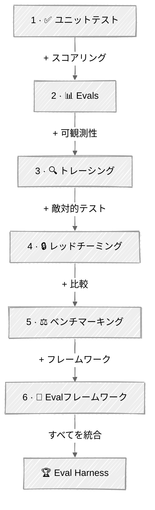

<!-- ---
title: "テスト & 評価"
description: "本番投入前にAIエージェントの品質を測定し、リグレッションを検出し、信頼を積み上げる"
--- -->

# テスト & 評価

エージェントは非決定的です——そのテストには異なる考え方が求められます。このモジュールでは、本番投入前にAIエージェントへの信頼を積み上げるためのメンタルモデル、パターン、テクニックを学びます。Anthropicの**eval駆動開発**の原則に従い、構築前に成功基準を定義し、品質を継続的に測定し、リグレッションを自動的に検出する方法を学びます。

## 🗺️ 進行パス

| ステップ | チュートリアル | 追加される要素 |
|:----:|----------|-------------|
| 1 | [ユニットテスト](01-unit-testing-agents/) | モックLLM、ツールの分離、振る舞い契約 |
| 2 | [Evals](02-evals/) | + ゴールデンデータセット、LLM-as-judge、pass@k/pass^kメトリクス |
| 3 | [トレーシング & デバッグ](03-tracing-debugging/) | + 実行トレース、スパンツリー、失敗分析 |
| 4 | [レッドチーミング & 安全性](04-red-teaming-safety/) | + プロンプトインジェクション、ガードレール検証 |
| 5 | [ベンチマーキング](05-benchmarking/) | + モデル/プロンプトの直接比較 |
| 6 | [Evalフレームワーク](06-eval-frameworks/) | + Promptfoo、Braintrust、Langfuse統合 |
| 🏆 | [Eval Harness](07-eval-harness/) | すべてのテクニックを完全なパイプラインに統合 |

## 💡 成功のためのヒント

1. **まずユニットテストから始める** — 高速で無料、エージェントの骨格に潜むほとんどのバグを捕捉できます
2. **早い段階でゴールデンデータセットを構築する** — 最適化を始める前に、代表的なタスクを20〜50件厳選しましょう
3. **複数種類のグレーダーを使う** — コードベース（高速・安価）とLLM-as-judge（繊細）を組み合わせましょう
4. **すべてをトレースする** — エージェントが失敗したとき、トレースが*なぜ*失敗したかを示します
5. **攻撃者のように考える** — レッドチーミングは、設計時に想定していなかった脆弱性を明らかにします
6. **雰囲気ではなくデータでベンチマークする** — 正確性・コスト・レイテンシをまとめて測定しましょう
7. **CI/CDでevalsを実行する** — リグレッションが本番に届く前に捕捉しましょう
8. **経路ではなく出力を採点する** — 特定のツール呼び出しの順序をチェックするのは避けましょう。エージェントは想定していなかった有効なアプローチを見つけることがあります

## 📚 チュートリアル

### [01 - ユニットテスト](01-unit-testing-agents/)

**学べること:**
- 決定的なテストのためにLLM応答をモックする
- ツールの実行を分離してテストする
- 振る舞い契約を検証する（エージェントが常に行うべきこと・決して行ってはいけないこと）
- API呼び出しなしで高速・安価なテストを実行する

**キーコンセプト:** モック&リプレイ、ツールの分離、振る舞いの不変条件、pytest

---

### [02 - Evals](02-evals/)

**学べること:**
- コードベースのグレーダー（キーワードマッチング、正規表現、出典引用）を構築する
- 構造化されたルーブリックによるLLM-as-judgeパターンを実装する
- ゴールデンデータセットを使ったエンドツーエンドの評価パイプラインを作成する
- pass@k（能力）とpass^k（一貫性）のメトリクスを計算する
- evalsを能力テストとリグレッションテストに分類する
- LLMジャッジを人間の基準に対してキャリブレーションする

**進化:** 決定的なアサーションを超え、エージェント品質の統計的評価へと踏み込みます

---

### [03 - トレーシング & デバッグ](03-tracing-debugging/)

**学べること:**
- コンテキストマネージャーによるスパンベースのトレースコレクターを構築する
- 実行トレースを分析してアンチパターンを検出する
- 記録されたトレースを使ってエージェントの失敗をデバッグする
- チェックポイントからエージェントの実行をリプレイする

**進化:** 完全な可観測性を追加します——evalが失敗したとき、トレースが正確に理由を示します

---

### [04 - レッドチーミング & 安全性](04-red-teaming-safety/)

**学べること:**
- プロンプトインジェクション攻撃（直接・間接）に対してエージェントをテストする
- 多層防御のガードレールパイプラインを構築・検証する
- 自動化されたLLM対LLMのレッドチーミングを実行する
- 攻撃成功率（ASR）を測定する

**進化:** 敵対的テストを追加します——攻撃者より先に脆弱性を探ります

---

### [05 - ベンチマーキング](05-benchmarking/)

**学べること:**
- 正確性・レイテンシ・コスト・トークン効率でモデルを比較する
- プロンプト戦略（zero-shot、few-shot、chain-of-thought）を評価する
- 設定マトリクスを構築し、パレート最適な構成を見つける
- データに基づいたモデル選定の意思決定を行う

**進化:** 体系的な比較を追加します——雰囲気ではなく測定に置き換えます

---

### [06 - Evalフレームワーク](06-eval-frameworks/)

**学べること:**
- **Promptfoo**（YAML + カスタムPythonプロバイダー）でevalスイートを宣言的に定義する
- **Braintrust AutoEvals**の構築済みスコアラー（Levenshtein、Factuality、カスタム分類器）を使う
- **Langfuse**のトレーシングとプログラム的スコアリングでエージェントを計装する
- フレームワークのトレードオフを比較する: CLI対SDK、ローカル対クラウド

**進化:** 手作りのevalsを、Anthropicのeval指南で推奨されている本番フレームワークに接続します

---

### 🏆 [07 - Eval Harness](07-eval-harness/)

**学べること:**
- すべてのテストテクニックを統一されたパイプラインに統合する
- Pydanticデータモデルによる再利用可能な評価ハーネスを構築する
- 包括的な品質・安全性・ベンチマークレポートを生成する
- eval駆動開発をエンドツーエンドで実践する
- シミュレーションモード（即座、APIキー不要）またはライブモード（`--live`で実際のAPI呼び出し）で実行する

**進化:** 集大成——ユニットテストのパターン、evals、トレーシング、レッドチーミング、ベンチマーキングを1つのevalハーネスに配線します

---

## 🔗 リソース

### 評価とテスト
- [Demystifying Evals for AI Agents — Anthropic](https://www.anthropic.com/engineering/demystifying-evals-for-ai-agents) — evalの基本語彙、グレーダーの分類、8ステップのロードマップ
- [Building Effective Agents — Anthropic](https://www.anthropic.com/research/building-effective-agents) — 何をテストすべきかを示唆するエージェントパターン
- [OpenAI Evaluation Best Practices](https://platform.openai.com/docs/guides/evaluation-best-practices) — 実践的なeval指南
- [Eval-Driven Development](https://evaldriven.org/) — 機能構築の前にevalsを構築するという規律
- [Judging LLM-as-a-Judge with MT-Bench and Chatbot Arena — Zheng et al., 2023](https://arxiv.org/abs/2306.05685) — LLMジャッジと構造化ルーブリック採点の体系的研究
- [Holistic Evaluation of Language Models (HELM) — Liang et al., 2022](https://arxiv.org/abs/2211.09110) — 正確性・頑健性・公平性・効率性を網羅するマルチメトリクス評価

### Evalフレームワーク
- [Promptfoo](https://www.promptfoo.dev/) — Python provider対応のYAML駆動eval CLI
- [Braintrust AutoEvals](https://github.com/braintrustdata/autoevals) — factuality・類似度・カスタム分類器の構築済みスコアラー
- [Langfuse](https://langfuse.com/) — オープンソースのトレーシング&評価プラットフォーム
- [Harbor](https://github.com/harbor-ai/harbor) — コンテナ化されたエージェントeval環境
- [LangSmith](https://smith.langchain.com/) — LangChain統合を備えたトレーシング&評価

### セキュリティと安全性
- [OWASP Top 10 for LLM Applications](https://owasp.org/www-project-top-10-for-large-language-model-applications/) — セキュリティ脆弱性の分類
- [OWASP Top 10 for Agentic Applications](https://owasp.org/www-project-top-10-for-agentic-applications/) — エージェント固有のセキュリティ上の懸念
- [Not What You've Signed Up For: Indirect Prompt Injection — Greshake et al., 2023](https://arxiv.org/abs/2302.12173) — ツール出力や外部コンテンツを介したLLM統合アプリケーションの侵害
- [Red Teaming Language Models to Reduce Harms — Ganguli et al., 2022](https://arxiv.org/abs/2209.07858) — Anthropicの体系的なレッドチーミング手法

### 可観測性とベンチマーキング
- [LLM-as-a-Judge Guide — Langfuse](https://langfuse.com/docs/evaluation/evaluation-methods/llm-as-a-judge) — LLMジャッジパターンの包括的ガイド
- [AI Agent Benchmarks — Evidently AI](https://www.evidentlyai.com/blog/ai-agent-benchmarks) — ベンチマークの全体像
- [Agent Evaluation in 2025 — orq.ai](https://orq.ai/blog/agent-evaluation) — 3つの評価戦略
- [Chatbot Arena: Evaluating LLMs by Human Preference — Chiang et al., 2024](https://arxiv.org/abs/2403.04132) — Eloレーティングによる人間の選好ベンチマーク手法

### 主要論文
- [Beyond Accuracy: Behavioral Testing of NLP Models with CheckList — Ribeiro et al., 2020](https://arxiv.org/abs/2005.04118) — 不変性・方向性・最小機能テストによる振る舞いテスト
- [Chain-of-Thought Prompting Elicits Reasoning — Wei et al., 2022](https://arxiv.org/abs/2201.11903) — 推論タスクで顕著な精度向上をもたらすCoTプロンプティング
- [Language Models are Few-Shot Learners — Brown et al., 2020](https://arxiv.org/abs/2005.14165) — プロンプティングのパラダイムとしてのin-context few-shot学習
